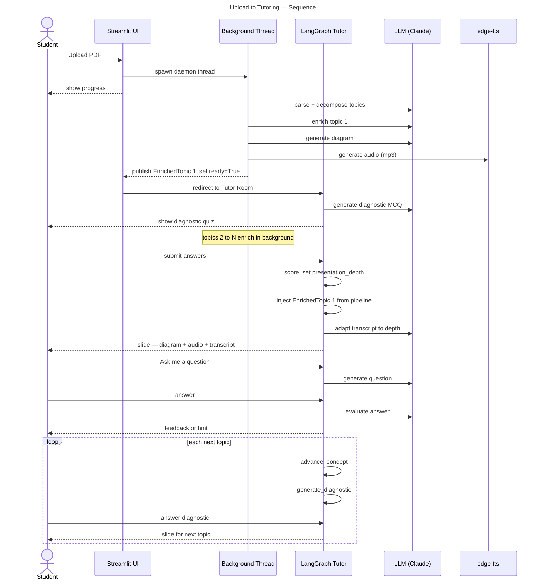
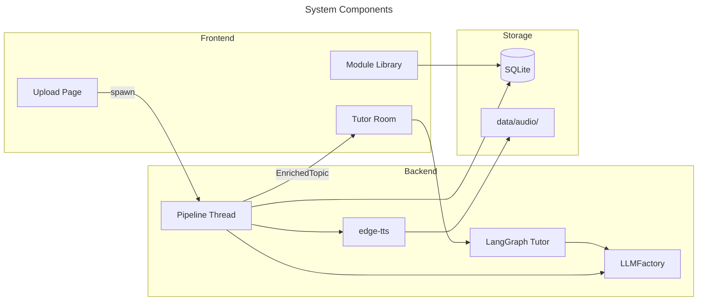
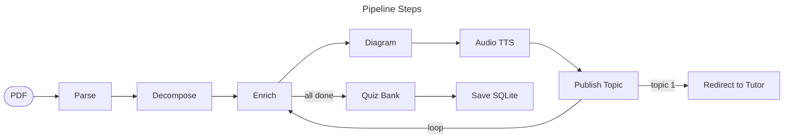
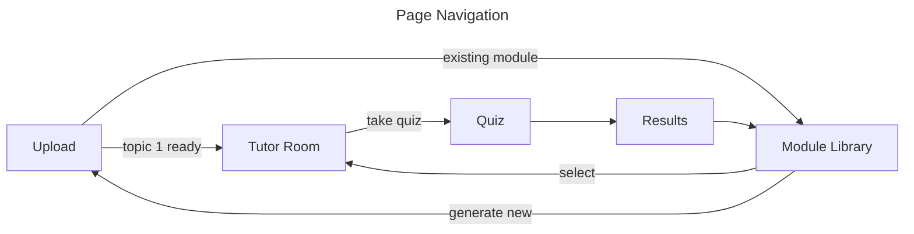

# AI Tutor — Architecture

> **Version:** 0.8 | **Updated:** 2026-06-14
> Companion to [SPEC.md](SPEC.md).

---

## 1. End-to-End Flow

The sequence below shows what happens from PDF upload to the end of a tutoring session. After upload, two concurrent activities run: a background pipeline that generates content and a LangGraph session that teaches.



---

## 2. System Components

Three layers — Streamlit frontend, backend orchestration, and storage — connected through a shared LLM factory.



---

## 3. Content Pipeline

The pipeline runs in a daemon thread. It publishes each `EnrichedTopic` to `st.session_state["pipeline_progress"]` immediately on completion. The UI redirects to the Tutor Room after topic 1 is ready (~30 s); remaining topics enrich in the background.

**Total LLM cost:** 3N + 2 calls + N TTS calls for N topics.



**EnrichedTopic fields:**

| Field | Source |
|---|---|
| `top_concepts` (2–3 strings) | Enricher LLM — key ideas shown as callout |
| `content_md` | Enricher LLM — conversational Markdown explanation |
| `key_takeaways` | Enricher LLM — 3–5 bullet summary |
| `diagrams` | Diagram LLM — Mermaid flowchart, max 6 nodes |
| `inline_questions` | Question LLM — 2 SCQ/MCQ per topic |
| `audio_path` | edge-tts — mp3 narration in `data/audio/` |

---

## 4. LangGraph Tutor

LangGraph is the primary entry point for every tutoring session. Nodes are dispatched manually (not via `graph.invoke()`) so Streamlit can render between each step.


**How it works:**

- `generate_diagnostic` creates 3–5 MCQ from topic title and summary only — no enriched content needed, so it runs immediately while the pipeline is still working.
- `evaluate_diagnostic` scores answers and sets `presentation_depth`: below 0.4 → beginner; 0.4–0.7 → intermediate; above 0.7 → advanced.
- `present_concept` checks if the pipeline has delivered `EnrichedTopic` for this concept. If yes, uses its diagram, audio, and top concepts. If not yet ready, generates a lightweight slide from title and summary.
- After mastering a concept, the loop returns to `generate_diagnostic` for the next topic.

---

## 5. LLM Factory

All LLM calls go through a single factory. Callers use Anthropic-format tool schemas; adapters translate for each backend.

| Adapter | Backend | Notes |
|---|---|---|
| `AnthropicAdapter` | Anthropic API | Prompt caching on document blocks |
| `PortkeyAdapter` | Portkey → Vertex AI | Same caching; routes via Portkey gateway |
| `OllamaAdapter` | Ollama (local) | Translates tool schema to OpenAI function format |

---

## 6. Database Schema

```mermaid
---
title: SQLite Tables
---
erDiagram
    users ||--o{ modules : creates
    users ||--o{ quiz_attempts : attempts
    modules ||--o{ quiz_attempts : tested_on
    users ||--o{ topic_mastery : tracks
    modules ||--o{ topic_mastery : covers

    users { TEXT user_id PK; TEXT username }
    modules { TEXT module_id PK; TEXT title }
    quiz_attempts { TEXT attempt_id PK; INTEGER score }
    topic_mastery { TEXT topic_id; INTEGER mastered }
```

---

## 7. Page Navigation

Upload is the only generation entry point. Module Library gives access to previously generated modules.


