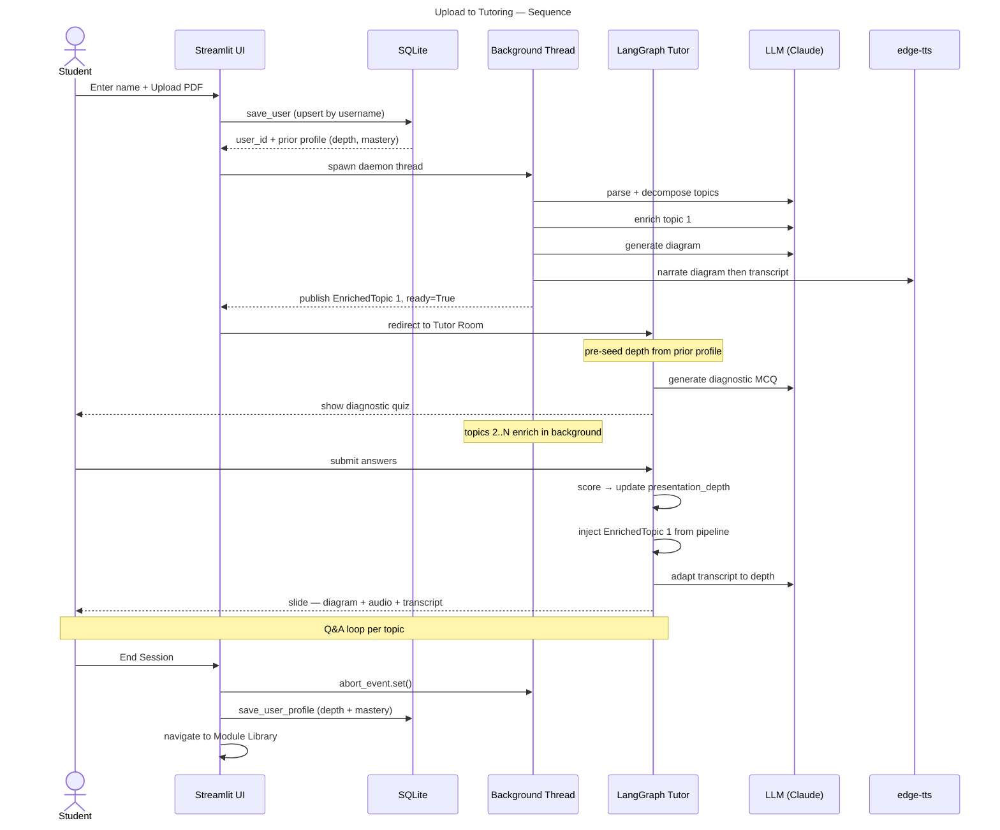
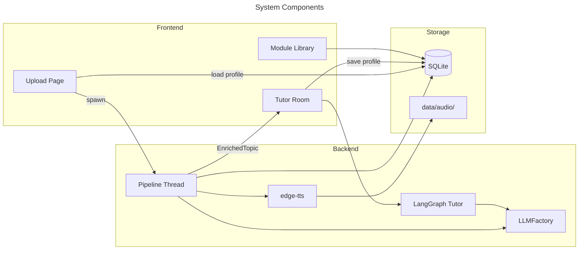
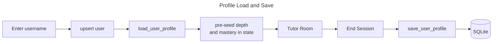
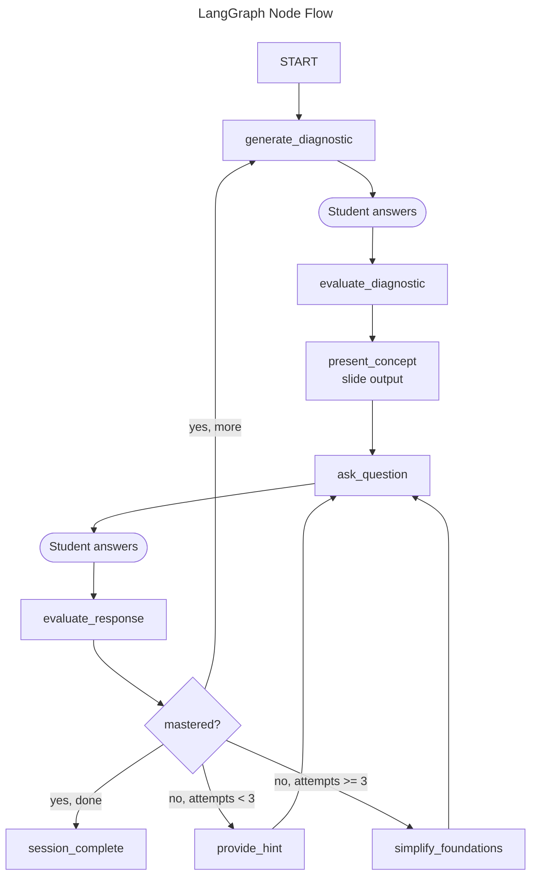
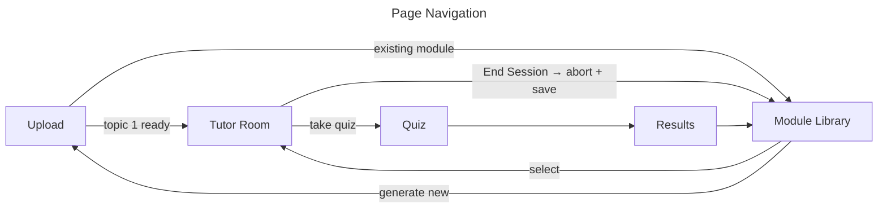

# AI Tutor — Architecture

> **Version:** 0.9 | **Updated:** 2026-06-14
> Companion to [SPEC.md](SPEC.md).

---

## 1. End-to-End Flow

After upload, two concurrent activities run: a background pipeline that generates content and a LangGraph session that teaches. The session is personalised — the student's name keys a persistent profile that carries expertise, preferred depth, and topic mastery across visits.



---

## 2. System Components



---

## 3. Content Pipeline

The pipeline runs in a daemon thread. It publishes each `EnrichedTopic` immediately on completion. The UI redirects to the Tutor Room after topic 1 is ready (~30 s). **End Session signals the abort event — the thread exits at the next checkpoint.**

**Total LLM cost:** 3N + 2 calls + N TTS calls for N topics.

**Audio narration is diagram-aware:** the TTS script opens by describing what the diagram shows, then continues with the concept explanation — speech and image are connected.


**EnrichedTopic fields:**

| Field | Source |
|---|---|
| `top_concepts` (2–3 strings) | Enricher LLM — key ideas shown as callout |
| `content_md` | Enricher LLM — conversational Markdown explanation |
| `key_takeaways` | Enricher LLM — 3–5 bullet summary |
| `diagrams` | Diagram LLM — Mermaid flowchart, max 6 nodes |
| `inline_questions` | Question LLM — 2 SCQ/MCQ per topic |
| `audio_path` | edge-tts — narrates diagram then transcript |

---

## 4. Personalised User Profile

Every student has a persistent profile keyed by username. When they return, the system reloads their prior depth preference and topic mastery so the tutor picks up where they left off.



**Profile data stored per user:**

| Field | Meaning |
|---|---|
| `overall_depth` | Last presentation depth (`beginner`/`intermediate`/`advanced`) |
| `topic_mastery` | JSON map of `topic_id → mastered` across all modules |
| `module_visits` | JSON map of `module_id → last_visited` |
| `last_seen` | Timestamp of last session |

On return: `presentation_depth` is initialised from `overall_depth`. Topics already marked mastered are shown as complete but can be revisited.

---

## 5. LangGraph Tutor

LangGraph is the primary entry point for every tutoring session. Nodes are dispatched manually so Streamlit can render between steps.



**Key behaviours:**

- `generate_diagnostic` uses only topic title and summary — no enriched content needed, runs immediately.
- `evaluate_diagnostic` scores answers and sets `presentation_depth`. Starting depth is seeded from user profile.
- `present_concept` uses `EnrichedTopic` assets (diagram, audio, top concepts) if the pipeline delivered them; falls back to LLM-generated slide.
- On End Session, `save_user_profile` is called with the final `presentation_depth` and all mastered topics.

---

## 6. LLM Factory

All LLM calls go through a single factory. Callers use Anthropic-format tool schemas; adapters translate for each backend.

| Adapter | Backend | Notes |
|---|---|---|
| `AnthropicAdapter` | Anthropic API | Prompt caching on document blocks |
| `PortkeyAdapter` | Portkey → Vertex AI | Same caching; routes via Portkey gateway |
| `OllamaAdapter` | Ollama (local) | Translates tool schema to OpenAI function format |

---

## 7. Database Schema

```mermaid
---
title: SQLite Tables
---
erDiagram
    users ||--o{ modules : creates
    users ||--o{ quiz_attempts : attempts
    users ||--|| user_profiles : has
    modules ||--o{ quiz_attempts : tested_on
    users ||--o{ topic_mastery : tracks
    modules ||--o{ topic_mastery : covers

    users { TEXT user_id PK; TEXT username }
    user_profiles { TEXT user_id PK; TEXT overall_depth; TEXT topic_mastery_json; TEXT module_visits_json; TEXT last_seen }
    modules { TEXT module_id PK; TEXT title }
    quiz_attempts { TEXT attempt_id PK; INTEGER score }
    topic_mastery { TEXT topic_id; INTEGER mastered; INTEGER attempts }
```

---

## 8. Page Navigation


