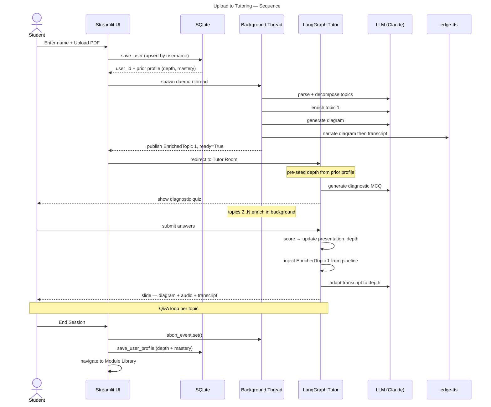
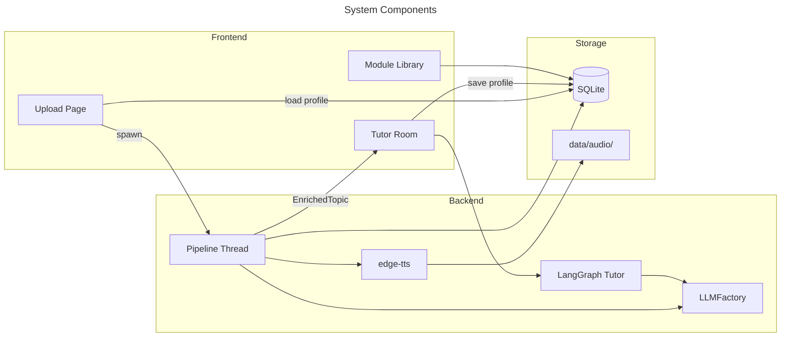
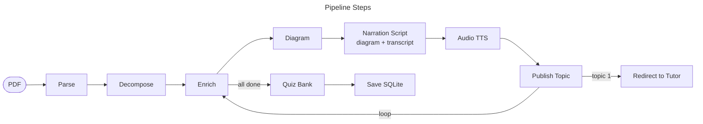
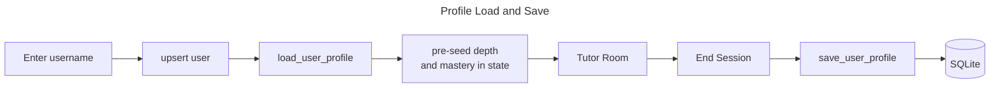
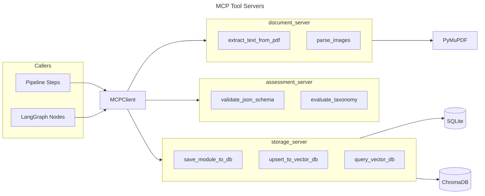
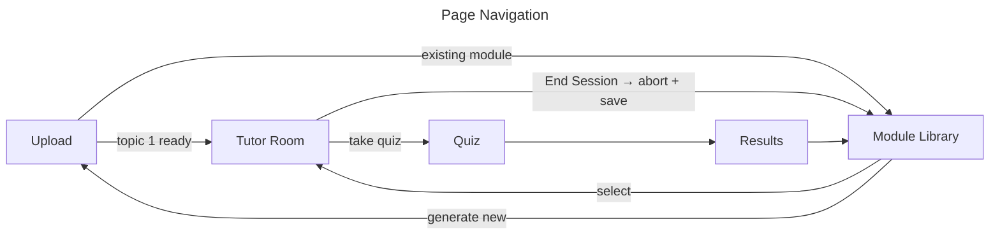
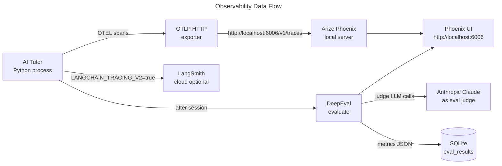

# AI Tutor — Architecture

> **Version:** 1.1 | **Updated:** 2026-06-14
> Companion to [SPEC.md](SPEC.md).

---

## 1. End-to-End Flow

After upload, two concurrent activities run: a background pipeline that generates content and a LangGraph session that teaches. The session is personalised — the student's name keys a persistent profile that carries expertise, preferred depth, and topic mastery across visits.



---

## 2. System Components



---

## 3. Content Pipeline

The pipeline runs in a daemon thread. It publishes each `EnrichedTopic` immediately on completion. The UI redirects to the Tutor Room after topic 1 is ready (~30 s). **End Session signals the abort event — the thread exits at the next checkpoint.**

**Total LLM cost:** 3N + 2 calls + N TTS calls for N topics.

**Audio narration is diagram-aware:** the TTS script opens by describing what the diagram shows, then continues with the concept explanation — speech and image are connected.



**EnrichedTopic fields:**

| Field | Source |
|---|---|
| `top_concepts` (2–3 strings) | Enricher LLM — key ideas shown as callout |
| `content_md` | Enricher LLM — conversational Markdown explanation |
| `key_takeaways` | Enricher LLM — 3–5 bullet summary |
| `diagrams` | Diagram LLM — Mermaid flowchart, max 6 nodes |
| `inline_questions` | Question LLM — 2 SCQ/MCQ per topic |
| `audio_path` | edge-tts — narrates diagram then transcript |

---

## 4. Personalised User Profile

Every student has a persistent profile keyed by username. When they return, the system reloads their prior depth preference and topic mastery so the tutor picks up where they left off.



**Profile data stored per user:**

| Field | Meaning |
|---|---|
| `overall_depth` | Last presentation depth (`beginner`/`intermediate`/`advanced`) |
| `topic_mastery` | JSON map of `topic_id → mastered` across all modules |
| `module_visits` | JSON map of `module_id → last_visited` |
| `last_seen` | Timestamp of last session |

On return: `presentation_depth` is initialised from `overall_depth`. Topics already marked mastered are shown as complete but can be revisited.

---

## 5. LangGraph Tutor

LangGraph is the primary entry point for every tutoring session. Nodes are dispatched manually so Streamlit can render between steps.


**Key behaviours:**

- `generate_diagnostic` uses only topic title and summary — no enriched content needed, runs immediately.
- `evaluate_diagnostic` scores answers and sets `presentation_depth`. Starting depth is seeded from user profile.
- `present_concept` uses `EnrichedTopic` assets (diagram, audio, top concepts) if the pipeline delivered them; falls back to LLM-generated slide.
- On End Session, `save_user_profile` is called with the final `presentation_depth` and all mastered topics.

---

## 6. LLM Factory

All LLM calls go through a single factory. Callers use Anthropic-format tool schemas; adapters translate for each backend.

| Adapter | Backend | Notes |
|---|---|---|
| `AnthropicAdapter` | Anthropic API | Prompt caching on document blocks |
| `PortkeyAdapter` | Portkey → Vertex AI | Same caching; routes via Portkey gateway |
| `OllamaAdapter` | Ollama (local) | Translates tool schema to OpenAI function format |

The same factory is used by the **DeepEval judge** — eval metrics use whichever provider is selected in the sidebar, with no separate API key.

---

## 7. MCP Tool Servers

Three standalone MCP servers expose storage, document parsing, and assessment tools. All backend code accesses these capabilities exclusively through `MCPClient` — no direct imports of `chromadb`, `fitz`, or SQLite outside the servers.



**Server responsibilities:**

| Server | Tools | Dependency |
|---|---|---|
| `document_server` | `extract_text_from_pdf`, `parse_images` | PyMuPDF |
| `assessment_server` | `validate_json_schema`, `evaluate_taxonomy` | Pure Python |
| `storage_server` | `save_module_to_db`, `upsert_to_vector_db`, `query_vector_db` | SQLite, ChromaDB, sentence-transformers |

MCP servers run as child processes started by `MCPClient`. They communicate over stdio using the MCP protocol. This means the storage layer can be replaced or scaled independently without touching pipeline or tutor code.

---

## 8. Database Schema

```mermaid
---
title: SQLite Tables
---
erDiagram
    users ||--o{ modules : creates
    users ||--o{ quiz_attempts : attempts
    users ||--|| user_profiles : has
    modules ||--o{ quiz_attempts : tested_on
    users ||--o{ topic_mastery : tracks
    modules ||--o{ topic_mastery : covers

    users { TEXT user_id PK; TEXT username }
    user_profiles { TEXT user_id PK; TEXT overall_depth; TEXT topic_mastery_json; TEXT module_visits_json; TEXT last_seen }
    modules { TEXT module_id PK; TEXT title }
    quiz_attempts { TEXT attempt_id PK; INTEGER score }
    topic_mastery { TEXT topic_id; INTEGER mastered; INTEGER attempts }
```

---

## 9. Page Navigation



---

## 10. LLM Observability and Evaluation

Every LLM call in the system is traced via OpenTelemetry. Traces are sent to a local **Arize Phoenix** server (no account required). After each tutoring session, **DeepEval** runs automated quality metrics. **LangSmith** receives LangGraph traces as a secondary destination via env vars.

### Tool Choices

| Tool | Package | Role |
|---|---|---|
| **Arize Phoenix** | `arize-phoenix` | Local OTLP trace server — UI at `http://localhost:6006` |
| **openinference-instrumentation-anthropic** | `openinference-instrumentation-anthropic` | Auto-patches Anthropic SDK — every `messages.create()` emits a span |
| **openinference-instrumentation-langchain** | `openinference-instrumentation-langchain` | Auto-patches LangGraph node calls |
| **opentelemetry-sdk** | `opentelemetry-sdk` | OTEL tracer provider + context propagation |
| **opentelemetry-exporter-otlp-proto-http** | `opentelemetry-exporter-otlp-proto-http` | HTTP exporter → Phoenix OTLP endpoint |
| **DeepEval** | `deepeval` | Programmatic eval metrics: faithfulness, answer relevancy, contextual precision |
| **LangSmith** | (env vars only, no new package) | Secondary trace destination for LangGraph — `LANGCHAIN_TRACING_V2=true` |

### Trace Flow



### What Gets Traced

| Span | Source | Key attributes |
|---|---|---|
| `anthropic.messages.create` | openinference auto-patch | model, prompt tokens, completion tokens, latency |
| LangGraph node execution | openinference auto-patch | node name, state diff, duration |
| Pipeline step (enrich / diagram / audio) | manual span via `tracer.start_as_current_span()` | topic title, step name |
| DeepEval eval run | deepeval built-in | metric scores, test case input/output |

### Eval Metrics (DeepEval)

Run after each tutoring session against the slide transcripts and Q&A turns:

| Metric | What it checks |
|---|---|
| `AnswerRelevancyMetric` | Tutor's explanation actually answers the topic (not off-topic) |
| `FaithfulnessMetric` | Transcript content is faithful to the source document (no hallucination) |
| `ContextualRecallMetric` | Key concepts from source appear in the enriched output |
| `GEval` (custom) | Diagnostic question quality — are questions fair for the stated topic? |

### Running Phoenix Locally

```bash
# Start Phoenix trace server (keeps running in background)
uv run python -m phoenix.server.main serve

# Or via the installed CLI
uv run phoenix serve
```

Phoenix UI is then available at `http://localhost:6006`.

### Environment Variables

| Variable | Value | Purpose |
|---|---|---|
| `OTEL_EXPORTER_OTLP_ENDPOINT` | `http://localhost:6006/v1/traces` | Route OTEL spans to local Phoenix |
| `LANGCHAIN_TRACING_V2` | `true` | Enable LangSmith tracing (optional) |
| `LANGCHAIN_API_KEY` | `ls-...` | LangSmith API key (optional) |
| `LANGCHAIN_PROJECT` | `ai-tutor` | LangSmith project name (optional) |

### Code Organisation

```
backend/
└── observability/
    ├── __init__.py        # setup_tracing() — call once at app startup
    ├── tracer.py          # get_tracer() helper used across pipeline steps
    └── eval_runner.py     # run_session_evals() — called by tutor_room on End Session
```

`setup_tracing()` is called from `app.py` before any LLM calls. It registers the OTLP exporter, instruments the Anthropic SDK, and optionally enables LangSmith.
