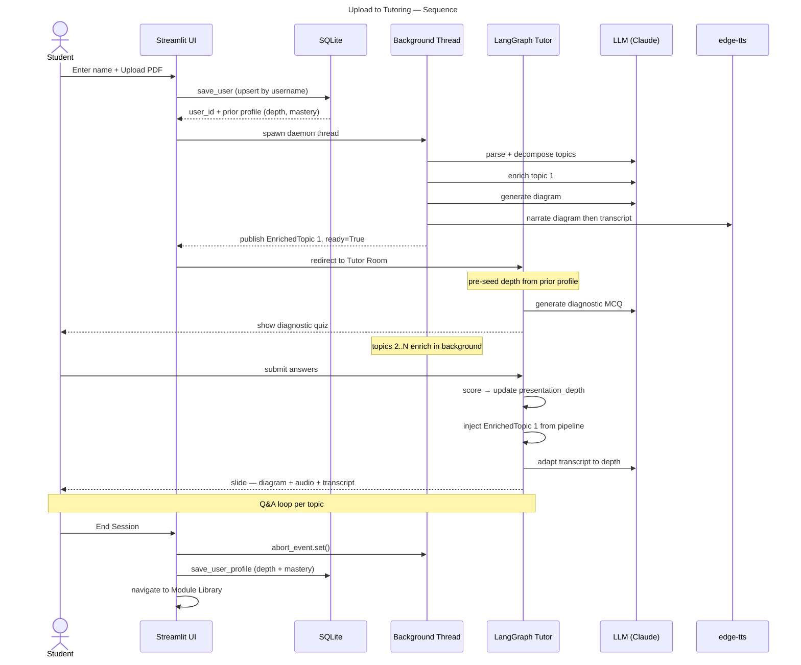
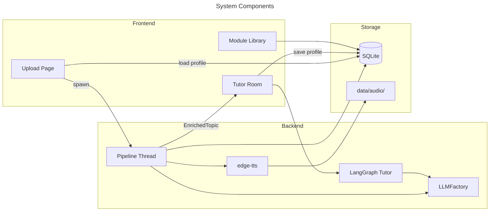
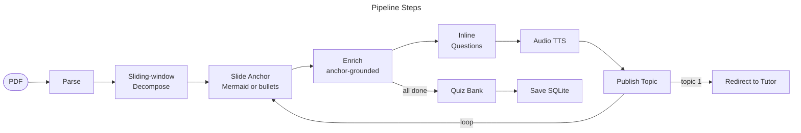
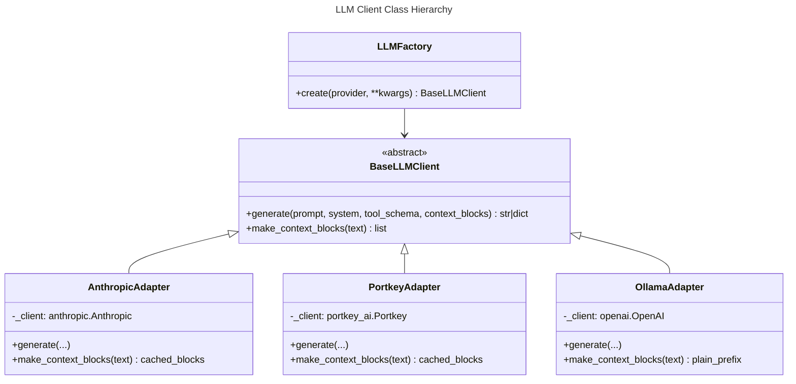
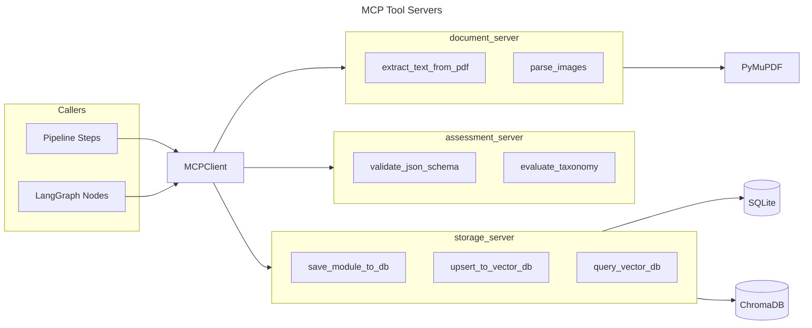
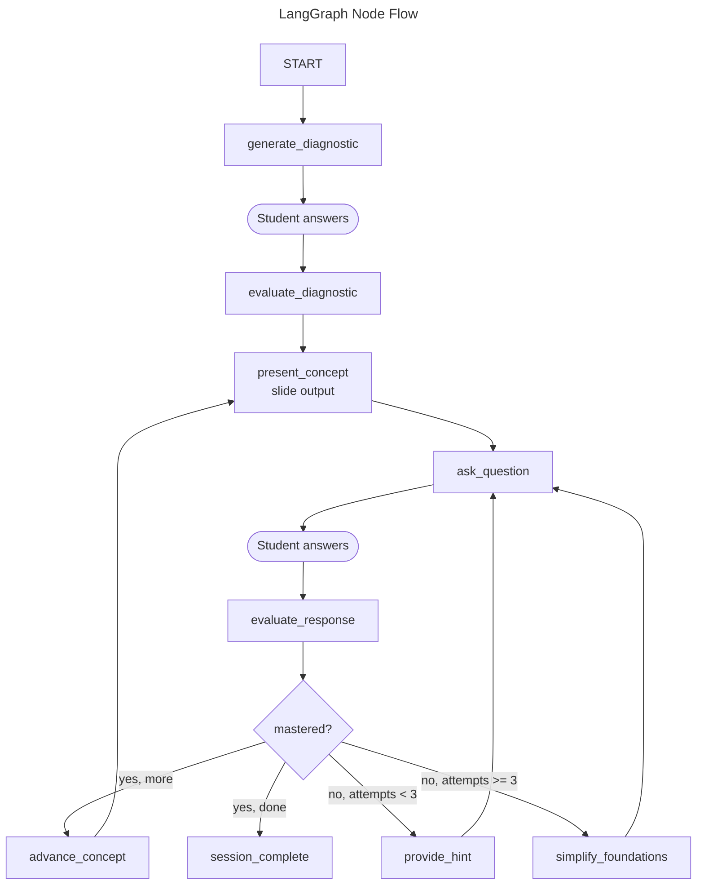
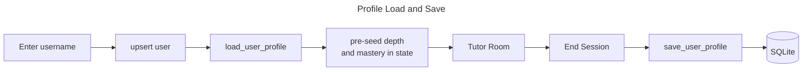
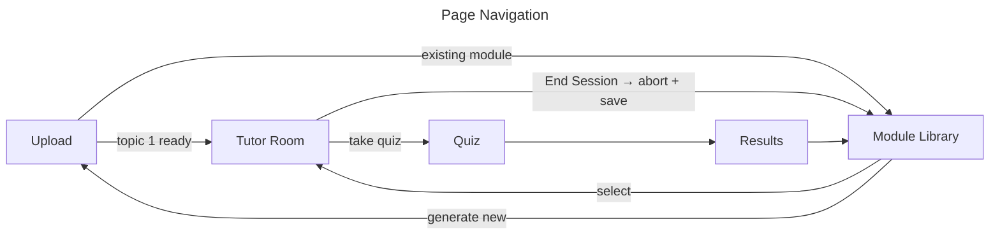
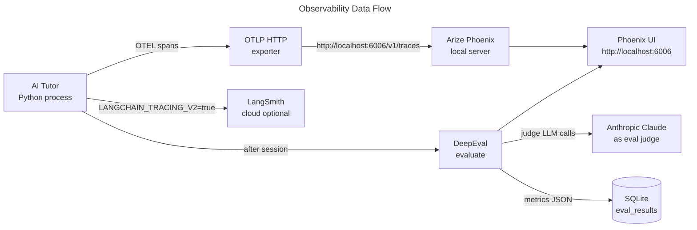

# AI Tutor — Architecture

> **Version:** 1.3 | **Updated:** 2026-06-14
> Companion to [SPEC.md](SPEC.md).

---

## 0. System Overview

### Problem

Static documents (PDFs, PowerPoint slides, Word docs) lead to passive learning and poor retention. Manually creating adaptive, interactive learning content is expensive, slow to update, and impossible to personalise at scale.

### Solution

AI Tutor is a web platform that transforms uploaded documents into interactive, adaptive learning experiences:

1. **Any user** uploads a PDF → a background pipeline (decompose → enrich → diagrams → audio → questions) generates a structured learning module; first topic is visible within ~30 seconds.
2. **Users** browse the module library → work through enriched content with diagram-first slides, audio narration, and inline questions, then take a quiz.
3. **Adaptive Tutor** (LangGraph) opens with a diagnostic quiz to calibrate depth, then walks through each concept as a slide, follows up with targeted questions, provides hints when the student struggles, and simplifies foundations after repeated failures.
4. **Admin mode** (Phase 3) lets an admin publish curated modules to the shared library so all users can access them without generating their own.

### High-Level Component Map

```
Streamlit Frontend
    ├── Login Page ──→ per-user DB (provider, model prefs)
    ├── Upload & Generate ──→ Background Pipeline (JIT) ──→ SQLite + ChromaDB
    ├── Module Library / Viewer / Quiz / Results ──→ SQLite
    ├── Tutor Room ──→ LangGraph Graph ──→ SQLite + ChromaDB
    │                       ↕
    │              MCP Tool Servers
    │           (document, assessment, storage)
    │                       ↕
    │                  LLMFactory
    │           (anthropic | portkey | ollama)
    └── System Check Page ──→ env + package validation
```

### Tech Stack

| Layer | Technology | Phase introduced |
|---|---|---|
| Frontend | Streamlit (multi-page) | 1 |
| Content generation | Direct LLM pipeline (sliding-window + JIT) | 2 |
| Adaptive tutor | LangGraph state machine | 2 |
| LLM providers | Anthropic SDK, Portkey, Ollama (OpenAI-compat) | 1 / 2 / 2 |
| LLM abstraction | Strategy + factory pattern (`BaseLLMClient`, `LLMFactory`) | 2 |
| Tool protocol | MCP (Model Context Protocol) | 2 |
| Vector store | ChromaDB + `sentence-transformers` (`all-MiniLM-L6-v2`) | 2 |
| Relational DB | SQLite (`sqlite3` stdlib), per-user preferences | 1 / 2 |
| Document parsing | PyMuPDF (PDF); PPTX + DOCX deferred to Phase 3 | 1 |
| Diagrams | Mermaid (LLM-generated, diagram-first approach) | 1 / 2 |
| Audio TTS | `edge-tts` (Microsoft Edge voices, offline) | 2 |
| LLM quality evals | DeepEval (LLM-as-judge, async, per session) | 2 |
| Observability | Arize Phoenix + OTEL (`opentelemetry-sdk`) | 2 |
| Package manager | `uv` | 1 |
| Python | 3.14+ | 1 |

---

## 1. Directory Structure

```
ai-tutor-platform/
│
├── .env.example                        # All env var templates
├── README.md                           # Setup, architecture, quickstart
├── pyproject.toml                      # Unified dependencies (uv)
├── SPEC.md
├── CLAUDE.md
│
├── mcp_servers/                        # TOOL LAYER — MCP microservices
│   ├── __init__.py
│   ├── document_server/                # Tools: extract_text_from_pdf, parse_images
│   ├── assessment_server/              # Tools: validate_json_schema, evaluate_taxonomy
│   └── storage_server/                 # Tools: upsert_to_vector_db, save_module_to_db, query_vector_db
│
├── backend/                            # CORE LOGIC LAYER
│   ├── core/
│   │   ├── mcp_client.py              # Helper to discover and call MCP tools
│   │   └── llm_client/               # Provider factory + adapters
│   │       ├── base.py               # Abstract BaseLLMClient
│   │       ├── factory.py            # LLMFactory.create(provider) -> BaseLLMClient
│   │       └── adapters/
│   │           ├── anthropic_adapter.py
│   │           ├── portkey_adapter.py
│   │           └── ollama_adapter.py
│   │
│   ├── ingestion/                     # Document parsers
│   │   ├── models.py                  # Document, Section, ExtractedImage dataclasses
│   │   ├── pdf_parser.py
│   │   ├── pptx_parser.py             # Phase 3
│   │   ├── docx_parser.py             # Phase 3
│   │   └── image_extractor.py
│   │
│   ├── content/                       # Content generation pipeline
│   │   ├── models.py                  # LearningModule, EnrichedTopic, Topic, Diagram, Question
│   │   ├── sliding_pipeline.py        # Sliding-window decomposition + JIT enrichment
│   │   ├── diagram_generator.py       # Diagram-first: Mermaid or bullet fallback
│   │   ├── content_enricher.py        # Anchor-grounded explanation generation
│   │   ├── inline_question_gen.py     # Per-topic inline comprehension questions
│   │   └── audio_generator.py         # edge-tts narration per topic
│   │
│   ├── interactive_tutor/             # ADAPTIVE TUTOR — LangGraph
│   │   ├── state.py                   # GraphState TypedDict
│   │   ├── nodes.py                   # All 8 node functions
│   │   └── graph.py                   # Compile graph with conditional router
│   │
│   ├── observability/                 # LLM quality + tracing
│   │   ├── tracer.py                  # OTEL setup → Arize Phoenix (+ optional LangSmith)
│   │   └── eval_runner.py             # DeepEval metrics (async, fire-and-forget per session)
│   │
│   ├── quiz/                          # Quiz engine (Phase 1 core)
│   │   ├── models.py
│   │   ├── question_bank.py
│   │   ├── difficulty.py
│   │   ├── assembler.py
│   │   └── evaluator.py
│   │
│   └── analytics/                     # Persistence + stats
│       ├── db.py
│       ├── models.py
│       ├── persistence.py
│       └── stats.py
│
├── frontend/                          # PRESENTATION LAYER
│   ├── app.py                         # Entry point, session init, router
│   ├── login_page.py                  # Login with per-user provider/model prefs
│   ├── upload_page.py                 # Upload PDF + run background JIT pipeline
│   ├── module_library_page.py         # Browse modules; admin publish controls (Phase 3)
│   ├── module_viewer.py               # Topics with diagram-first slides, audio, inline Qs
│   ├── quiz_page.py
│   ├── results_page.py
│   ├── tutor_room.py                  # LangGraph tutor: diagnostic → slides → Q&A
│   ├── system_check_page.py           # Verify env + packages
│   └── demo_mode.py                   # Sidebar toggle — fixture JSON, bypasses pipeline
│
├── tests/
│   ├── test_ingestion/
│   ├── test_content/
│   ├── test_quiz/
│   ├── test_analytics/
│   ├── test_llm_client/
│   ├── test_mcp/
│   └── fixtures/
│
└── data/                              # Runtime data (gitignored)
    ├── uploads/
    ├── generated/
    ├── ai_tutor.db
    └── chroma/                        # ChromaDB persistent store
```

---

## 2. End-to-End Flow

After upload, two concurrent activities run: a background pipeline that generates content and a LangGraph session that teaches. The session is personalised — the student's name keys a persistent profile that carries expertise, preferred depth, and topic mastery across visits.



---

## 3. System Components



---

## 4. Content Pipeline

The pipeline runs in a daemon thread. It publishes each `EnrichedTopic` immediately on completion. The UI redirects to the Tutor Room after topic 1 is ready (~30 s). **End Session signals the abort event — the thread exits at the next checkpoint.**

**Total LLM cost:** 3N + 2 calls + N TTS calls for N topics.

**Audio narration is diagram-aware:** the TTS script opens by describing what the diagram shows, then continues with the concept explanation — speech and image are connected.



### 4.1 Sliding-Window Decomposition

- Accumulate ~500 words at a time; LLM assesses whether the window is a teachable concept
- Force-publish after 1500 words; fallback if nothing published by end of doc
- Output: `list[Topic]`

### 4.2 Slide Anchor (diagram-first)

Every slide has a visual or structural anchor written before the explanation:

| Anchor type | When used | Rendered as |
|---|---|---|
| Mermaid diagram | LLM produces valid Mermaid code | `streamlit-mermaid` component |
| Bulleted key points | Diagram fails or produces empty output | `st.markdown` bullet list |

The anchor is passed to `enrich()` so the explanation explicitly references it. The explanation must not introduce concepts not visible in the anchor.

### 4.3 Just-in-Time Delivery

```
User uploads PDF
    ├─ Parse PDF (~1s)
    ├─ Decompose into topics (1 LLM call, ~5–10s)
    ├─ Enrich topic 1 (3 LLM calls + TTS, ~15–30s)
    │   → redirect to module viewer
    ├─ [background] Enrich topics 2…N
    │   → each appears in viewer as it completes (@st.fragment poll)
    └─ [background] Generate quiz bank
        → "Take Quiz" button enables when ready
```

**EnrichedTopic fields:**

| Field | Source |
|---|---|
| `top_concepts` (2–3 strings) | Enricher LLM — key ideas shown as callout |
| `content_md` | Enricher LLM — conversational Markdown explanation |
| `key_takeaways` | Enricher LLM — 3–5 bullet summary |
| `diagrams` | Diagram LLM — Mermaid flowchart, max 6 nodes |
| `inline_questions` | Question LLM — 2 SCQ/MCQ per topic |
| `audio_path` | edge-tts — narrates diagram then transcript |

---

## 5. LLM Factory

All LLM calls go through a single factory. Callers always pass Anthropic-format tool schemas; adapters translate for each backend.



### Adapters

| Adapter | SDK | Tool schema | Caching |
|---|---|---|---|
| `AnthropicAdapter` | `anthropic` | Anthropic native (`input_schema`) | `cache_control` blocks |
| `PortkeyAdapter` | `portkey_ai` | Anthropic native | `cache_control` blocks |
| `OllamaAdapter` | `openai` (compat) | OpenAI function format (translated internally) | No caching |

`LLMFactory.create(provider)` reads `AI_TUTOR_LLM_PROVIDER` from env if provider is `None`. The same factory is used by the **DeepEval judge** — eval metrics use whichever provider is selected in the sidebar, with no separate API key.

---

## 6. MCP Tool Servers

Three standalone MCP servers expose storage, document parsing, and assessment tools. All backend code accesses these capabilities exclusively through `MCPClient` — no direct imports of `chromadb`, `fitz`, or SQLite outside the servers. MCP servers run as child processes started by `MCPClient`, communicating over stdio.



### document_server tools

| Tool | Signature | Description |
|---|---|---|
| `extract_text_from_pdf` | `(file_path: str, max_pages: int) -> list[SectionDict]` | Parse PDF, return sections with title + body |
| `parse_images` | `(file_path: str, output_dir: str) -> list[ImageDict]` | Extract embedded images, save as PNG |

### assessment_server tools

| Tool | Signature | Description |
|---|---|---|
| `validate_json_schema` | `(data: dict, schema_name: str) -> ValidationResult` | Assert output matches expected schema |
| `evaluate_taxonomy` | `(question: dict) -> TaxonomyTag` | Tag a question with Bloom's taxonomy level |

### storage_server tools

| Tool | Signature | Description |
|---|---|---|
| `save_module_to_db` | `(module_json: str, bank_json: str, created_by: str) -> str` | Persist module + bank to SQLite, return `module_id` |
| `upsert_to_vector_db` | `(texts: list[str], metadata: list[dict], collection: str) -> None` | Embed and store chunks in ChromaDB |
| `query_vector_db` | `(query: str, collection: str, n_results: int) -> list[dict]` | Semantic search over stored chunks |

### MCPClient interface (`backend/core/mcp_client.py`)

```python
class MCPClient:
    def call(self, server: str, tool: str, **kwargs) -> dict: ...
    def list_tools(self, server: str) -> list[str]: ...
```

---

## 7. LangGraph Tutor

LangGraph is the primary entry point for every tutoring session. Nodes are dispatched manually so Streamlit can render between steps.



### Graph State (`backend/interactive_tutor/graph.py`)

```python
class GraphState(TypedDict):
    # Current position
    current_concept: str
    concept_content: str           # enriched Markdown (from pipeline or generated)
    concept_summary: str           # topic summary from decomposer
    current_question: dict | None
    student_answer: str

    # Diagnostic
    diagnostic_questions: list[dict]   # MCQ questions shown before first slide
    diagnostic_answers: list[int]      # student's choices
    diagnostic_score: float            # 0.0–1.0
    presentation_depth: str            # "beginner" | "intermediate" | "advanced"

    # Slide content
    topic_diagram: str             # Mermaid code for current concept
    topic_audio_path: str          # path to mp3 narration
    topic_top_concepts: list[str]  # 2–3 key concept labels
    enriched_topic: dict | None    # EnrichedTopic asdict — injected by UI when ready

    # Tracking
    attempts: int
    concept_mastered: bool
    mastered_concepts: list[str]
    remaining_concepts: list[str]

    # Conversation
    chat_history: list[dict]
```

### Nodes

| Node | What it does |
|---|---|
| `generate_diagnostic` | Generates 3 MCQ questions using only topic title + summary — runs immediately, no enriched content needed |
| `evaluate_diagnostic` | Scores answers; sets `presentation_depth` (beginner / intermediate / advanced), seeded from user profile |
| `present_concept` | Delivers slide: diagram + audio (if ready) + depth-calibrated transcript. Falls back to LLM-generated slide if pipeline not done |
| `ask_question` | Generates a targeted question assessing the current concept |
| `evaluate_response` | Analyses answer for specific misconceptions; sets `concept_mastered`; increments `attempts` |
| `provide_hint` | Generates a hint tailored to the student's specific error — does not reveal the answer |
| `simplify_foundations` | After 3 failed attempts: breaks concept into building blocks, re-teaches from basics |
| `advance_concept` | Pops next concept from `remaining_concepts`; resets per-concept tracking |

### Mastery Persistence (Phase 3)

`SqliteSaver` checkpointer wired to allow sessions to resume. New `topic_mastery` table:

```sql
CREATE TABLE IF NOT EXISTS topic_mastery (
    user_id       TEXT NOT NULL,
    module_id     TEXT NOT NULL,
    topic_id      TEXT NOT NULL,
    mastered      INTEGER NOT NULL DEFAULT 0,
    difficulty    TEXT NOT NULL DEFAULT 'easy',
    attempts      INTEGER NOT NULL DEFAULT 0,
    last_updated  TEXT NOT NULL DEFAULT (datetime('now')),
    PRIMARY KEY (user_id, module_id, topic_id)
);
```

---

## 8. Personalised User Profile

Every student has a persistent profile keyed by username. When they return, the system reloads their prior depth preference and topic mastery so the tutor picks up where they left off.



| Field | Meaning |
|---|---|
| `overall_depth` | Last presentation depth (`beginner`/`intermediate`/`advanced`) |
| `topic_mastery` | JSON map of `topic_id → mastered` across all modules |
| `module_visits` | JSON map of `module_id → last_visited` |
| `last_seen` | Timestamp of last session |

---

## 9. Frontend Pages

| Page | File | Purpose | Phase |
|---|---|---|---|
| Login | `frontend/login_page.py` | Username + provider/model prefs; persisted per user in SQLite | 2 |
| Upload | `frontend/upload_page.py` | Upload PDF, run background JIT pipeline, abort support | 2 |
| Module Library | `frontend/module_library_page.py` | Browse modules; admin publish/unpublish controls (Phase 3) | 1/3 |
| Module Viewer | `frontend/module_viewer.py` | Diagram-first slides, audio toggle, 60s auto-advance, inline Qs, deferred quiz button | 2 |
| Quiz | `frontend/quiz_page.py` | Difficulty selector, questions, submit | 1 |
| Results | `frontend/results_page.py` | Score, cohort bar chart, per-question breakdown | 1 |
| Tutor Room | `frontend/tutor_room.py` | Diagnostic quiz → slide presentation → Q&A loop with hints | 2 |
| System Check | `frontend/system_check_page.py` | Verify packages + env vars before running | 2 |
| Demo Mode | `frontend/demo_mode.py` | Sidebar toggle — fixture JSON, bypasses pipeline | 1 |

### Admin Mode (Phase 3)

- Any user can generate a personal module (existing behaviour)
- An admin user (configured username or password) can mark a module as **published**
- Published modules appear in the shared library for all users, even those who did not generate it
- Adds `is_published INTEGER DEFAULT 0` column to the `modules` table and publish/unpublish controls on `module_library_page.py`

### Page Navigation



`system_check` is accessible from the sidebar at any time.

---

## 10. Data Models (Interface Contracts)

### Document (`backend/ingestion/models.py`)

```python
@dataclass
class Section:
    section_id: str; title: str; body: str; level: int
    images: list[ExtractedImage] = field(default_factory=list)

@dataclass
class Document:
    doc_id: str; title: str; source_filename: str
    source_type: SourceType; sections: list[Section]; total_pages: int
```

### Learning Module (`backend/content/models.py`)

```python
@dataclass
class SlideAnchor:
    diagram: Diagram | None          # Mermaid diagram if generation succeeded
    bullets: list[str]               # 4–6 key points if diagram generation failed

@dataclass
class EnrichedTopic:
    topic: Topic; content_md: str; key_takeaways: list[str]
    diagrams: list[Diagram]; inline_questions: list[Question]
    top_concepts: list[str]          # 2–3 key concept labels
    audio_path: str                  # path to edge-tts mp3 narration

@dataclass
class LearningModule:
    module_id: str; title: str; source_doc_id: str
    topics: list[EnrichedTopic]; created_at: str
    is_published: bool = False        # Phase 3: admin can publish to shared library
```

### Quiz (`backend/quiz/models.py`) and Analytics (`backend/analytics/models.py`)

Unchanged from Phase 1 — see source files.

### Analytics additions (Phase 3)

- `get_mastery_report(user_id, module_id) -> MasteryReport` — per-topic mastery, attempts, final difficulty
- `get_cohort_mastery(module_id) -> CohortMastery` — average mastery rate per topic across all users

---

## 11. Database Schema

```mermaid
---
title: SQLite Tables
---
erDiagram
    users ||--o{ modules : creates
    users ||--o{ quiz_attempts : attempts
    users ||--|| user_profiles : has
    modules ||--o{ quiz_attempts : tested_on
    users ||--o{ topic_mastery : tracks
    modules ||--o{ topic_mastery : covers

    users { TEXT user_id PK; TEXT username }
    user_profiles { TEXT user_id PK; TEXT overall_depth; TEXT topic_mastery_json; TEXT module_visits_json; TEXT last_seen }
    modules { TEXT module_id PK; TEXT title; INTEGER is_published }
    quiz_attempts { TEXT attempt_id PK; INTEGER score }
    topic_mastery { TEXT topic_id; INTEGER mastered; INTEGER attempts }
```

ChromaDB collection `modules` holds one chunk per `EnrichedTopic`. Accessed exclusively through `storage_server` MCP tools — no direct `chromadb` imports outside the server.

---

## 12. LLM Observability and Evaluation

Every LLM call in the system is traced via OpenTelemetry. Traces are sent to a local **Arize Phoenix** server (no account required). After each tutoring session, **DeepEval** runs automated quality metrics. **LangSmith** receives LangGraph traces as a secondary destination via env vars.

### Tool Choices

| Tool | Package | Role |
|---|---|---|
| **Arize Phoenix** | `arize-phoenix` | Local OTLP trace server — UI at `http://localhost:6006` |
| **openinference-instrumentation-anthropic** | `openinference-instrumentation-anthropic` | Auto-patches Anthropic SDK — every `messages.create()` emits a span |
| **openinference-instrumentation-langchain** | `openinference-instrumentation-langchain` | Auto-patches LangGraph node calls |
| **opentelemetry-sdk** | `opentelemetry-sdk` | OTEL tracer provider + context propagation |
| **opentelemetry-exporter-otlp-proto-http** | `opentelemetry-exporter-otlp-proto-http` | HTTP exporter → Phoenix OTLP endpoint |
| **DeepEval** | `deepeval` | Programmatic eval metrics: faithfulness, answer relevancy, contextual precision |
| **LangSmith** | (env vars only, no new package) | Secondary trace destination for LangGraph — `LANGCHAIN_TRACING_V2=true` |

### Trace Flow



### What Gets Traced

| Span | Source | Key attributes |
|---|---|---|
| `anthropic.messages.create` | openinference auto-patch | model, prompt tokens, completion tokens, latency |
| LangGraph node execution | openinference auto-patch | node name, state diff, duration |
| Pipeline step (enrich / diagram / audio) | manual span via `tracer.start_as_current_span()` | topic title, step name |
| DeepEval eval run | deepeval built-in | metric scores, test case input/output |

### Eval Metrics (DeepEval)

Run after each tutoring session against the slide transcripts and Q&A turns:

| Metric | What it checks |
|---|---|
| `AnswerRelevancyMetric` | Tutor's explanation actually answers the topic (not off-topic) |
| `FaithfulnessMetric` | Transcript content is faithful to the source document (no hallucination) |
| `ContextualRecallMetric` | Key concepts from source appear in the enriched output |
| `GEval` (custom) | Diagnostic question quality — are questions fair for the stated topic? |

### Running Phoenix Locally

```bash
uv run phoenix serve
```

Phoenix UI is then available at `http://localhost:6006`.

### Code Organisation

```
backend/
└── observability/
    ├── __init__.py        # setup_tracing() — call once at app startup
    ├── tracer.py          # get_tracer() helper used across pipeline steps
    └── eval_runner.py     # run_session_evals() — called by tutor_room on End Session
```

`setup_tracing()` is called from `app.py` before any LLM calls.
