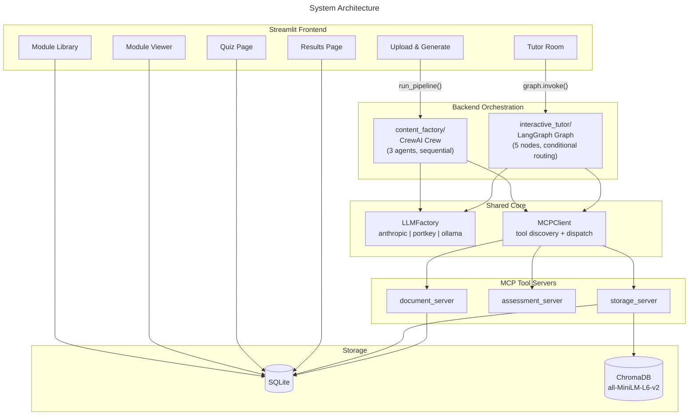
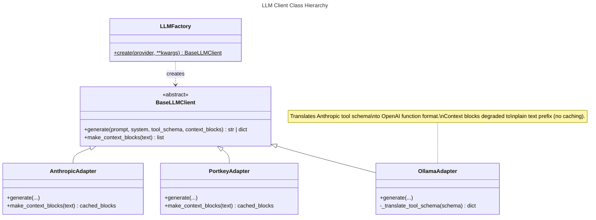
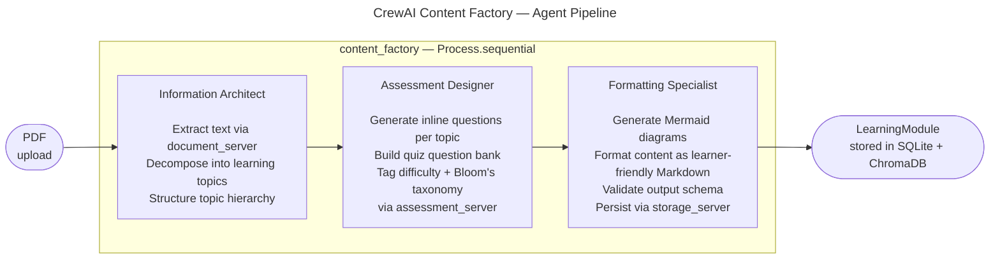
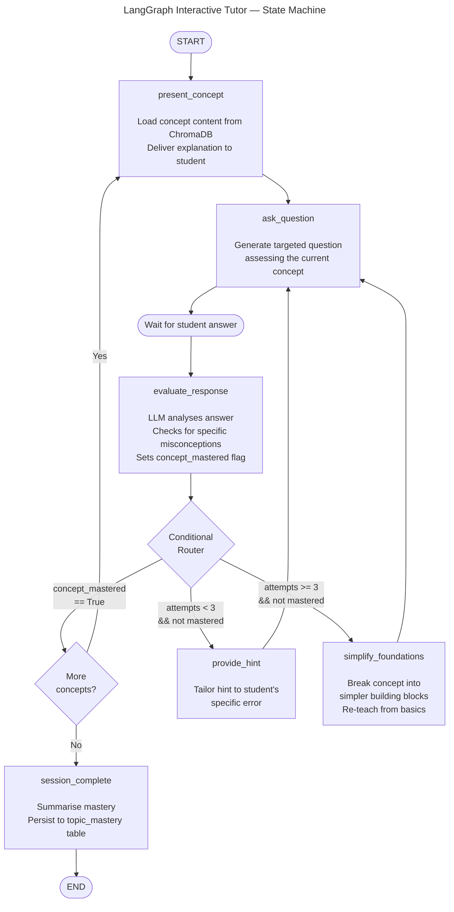
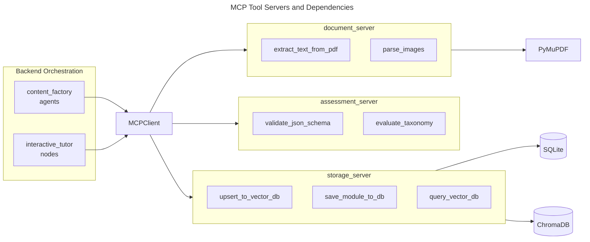
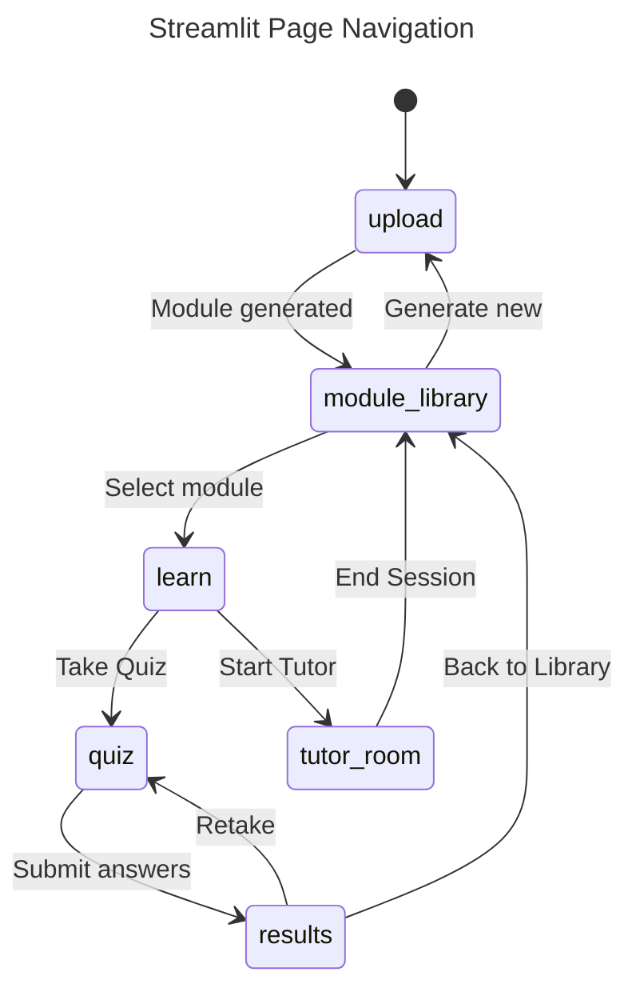
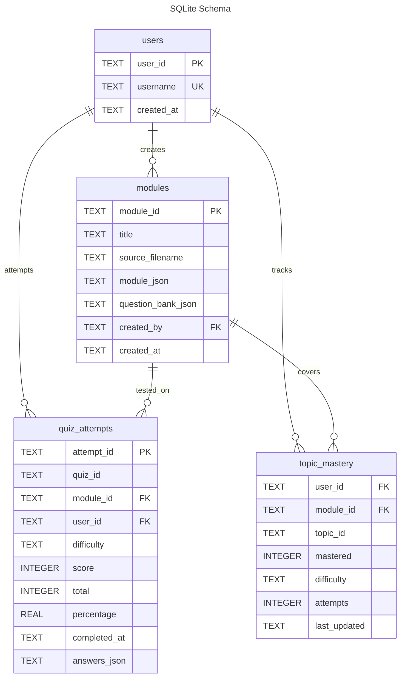
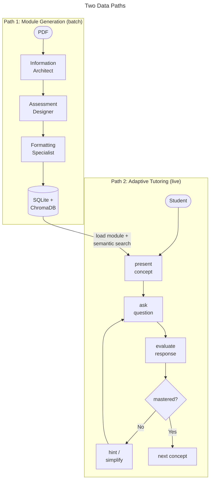

# AI Tutor — Architecture Document

> **Version:** 0.5 | **Updated:** 2026-06-12
> Companion to [SPEC.md](SPEC.md).

---

## 1. System Overview

Three layers — presentation, orchestration, and tool services — connected through a unified LLM factory.



---

## 2. LLM Client — Factory & Adapters

All LLM access goes through a single factory. Callers pass Anthropic-format tool schemas; adapters translate internally.



---

## 3. CrewAI Content Factory

Three agents run sequentially. Each agent's output is the next agent's input. Agents call MCP tool servers for document extraction, assessment validation, and storage.



**MCP tool usage by agent:**

| Agent | MCP server | Tools called |
|---|---|---|
| Information Architect | `document_server` | `extract_text_from_pdf`, `parse_images` |
| Assessment Designer | `assessment_server` | `evaluate_taxonomy` |
| Formatting Specialist | `storage_server` | `upsert_to_vector_db`, `save_module_to_db` |

---

## 4. LangGraph Interactive Tutor

Five node functions connected by a conditional router. The graph is the single source of truth for the tutoring session — every decision is made by inspecting `GraphState`.

### Graph State

```python
class GraphState(TypedDict):
    current_concept: str           # topic currently being taught
    concept_content: str           # enriched content from ChromaDB
    current_question: dict | None  # active question
    attempts: int                  # attempts on current concept (reset per concept)
    concept_mastered: bool         # set by evaluate_response
    mastered_concepts: list[str]   # accumulates across session
    chat_history: Annotated[list, add_messages]
    user_id: str
    module_id: str
```

### Graph Flow



### Router Logic

```
after evaluate_response:
    if concept_mastered:
        → next concept (or session_complete if all done)
    elif attempts < 3:
        → provide_hint → ask_question (retry)
    else:
        → simplify_foundations → ask_question (fresh approach)
```

---

## 5. MCP Tool Servers

Three standalone MCP servers. All backend orchestration (CrewAI agents, LangGraph nodes) accesses tools exclusively through `MCPClient` — no direct imports of `chromadb`, `fitz`, etc. outside the servers.



---

## 6. Frontend Navigation

No admin/user separation. Any user can upload a PDF to generate a module, browse the library, learn, or enter the adaptive tutor.



---

## 7. Database Schema



---

## 8. Data Flow — End to End

Two independent paths through the system: batch generation (CrewAI) and live tutoring (LangGraph).


