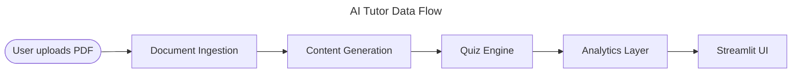

# CLAUDE.md — AI Tutor Project

## Project Overview

**Problem:** Static documents (PowerPoint, PDF, Word) lead to passive learning and poor knowledge retention. Manually creating interactive content is expensive and hard to scale.

**Solution:** AI Tutor is a Streamlit web app that transforms static documents (PDF, PPTX, DOCX, VTT transcripts) into dynamic, interactive learning modules with sub-topic decomposition, Mermaid diagrams, inline questions, quizzes with selectable difficulty, and a LangGraph adaptive tutor. A comprehensive end-of-module quiz features randomised questions, per-question explanations, and cohort analytics (score vs. min/max/avg of all participants).

All authoritative requirements live in **SPEC.md**. Architecture diagrams are in **ARCHITECTURE.md**.

---

## Project Status

| Phase | Name | Status |
|-------|------|--------|
| 1 | PDF POC | ✅ Complete |
| 2 | Functional Skeleton | ✅ Complete |
| 3 | Refined Platform | 🔄 In Progress |
| 4 | VTT Transcript Ingestion | ✅ Complete |

---

## Workflow Rules

### 1. Always update SPEC.md first

Before writing any code for a new feature or change:
1. Update `SPEC.md` with the relevant section changes, new decisions, or resolved open questions.
2. If a requirement is ambiguous or contradicts existing spec, **ask the user to confirm** — never assume.
3. Only proceed to implementation after the spec reflects the intended design.

### 2. Create plan.md before implementing

For every non-trivial task (new module, feature, or significant change):
1. Create or update `plan.md` at the repo root with:
   - **Goal** — what will be built or changed.
   - **Phases** — numbered steps, each scoped to a single commit.
   - **Files affected** — list files to be created or modified.
   - **Open questions** — anything that needs user confirmation before proceeding.
2. Present the plan to the user and wait for approval before writing code.
3. Keep `plan.md` updated as phases complete.

### 3. Commit after each phase

After each phase in `plan.md` is complete:
- **Always use the `/git-commit` skill** — never run `git commit` directly. Invoke it with the Skill tool (`skill: "git-commit"`).
- Commit message format: `[Phase N] <short description>` (e.g., `[Phase 1] Add data pipeline`).
- Do not bundle multiple phases into one commit.
- The skill handles staging, commit message formatting, and any pre-commit hooks.
- **Committing to `main` is explicitly allowed** — this is an assignment repository with a single-branch workflow.

### 4. Update pyproject.toml for new dependencies

Whenever a new library is identified (during planning or implementation):
1. Add it to `pyproject.toml` under `[project] dependencies`.
2. Install with `uv add <package>` so `uv.lock` stays in sync.
3. Do not use `pip install` directly — always go through `uv`.

### 5. Update README.md after each phase

After committing a phase:
- Update `README.md` with any new setup steps, CLI usage, or changed entry points.
- The README must always reflect the current runnable state of the repo.

### 6. Maintain references.md

- Keep `references.md` at the repo root with annotated links to documentation, papers, and tutorials for every key technology used.
- Add entries when a new library or technique is introduced.
- Format: `## <Topic>` heading, then bullet list of `[Title](URL) — one-line explanation`.

---

## Python & Package Management

- **Runtime:** Python 3.13 (see `.python-version`).
- **Package manager:** [`uv`](https://docs.astral.sh/uv/) — use it for all dependency and environment operations.
- **Running the app:** `uv run python run.py` — `run.py` sets `PYTHONPATH` automatically and launches Streamlit. Works on both Linux/macOS and Windows.
- **Running scripts manually:** `PYTHONPATH=. uv run python <script>.py` — the `PYTHONPATH=.` is required so subpackages resolve correctly from the project root.
- **Running tests:** `PYTHONPATH=. uv run pytest -v` (skip slow tests with `-m "not slow"`).
- **Adding packages:** `uv add <package>` (updates `pyproject.toml` and `uv.lock`).
- **Removing packages:** `uv remove <package>`.
- **Sync environment:** `uv sync` after pulling changes that modify `pyproject.toml`.

---

## Project Structure

```
deepl-ai-tutor/
├── run.py                          # App runner — sets PYTHONPATH, launches Streamlit
├── app.py                          # Streamlit entry point, sidebar, page router
├── backend/
│   ├── core/
│   │   ├── llm_client/             # LLM factory + adapters (Anthropic, Portkey, Ollama)
│   │   │   ├── base.py             # BaseLLMClient abstract class
│   │   │   ├── factory.py          # LLMFactory.create() → provider adapter
│   │   │   └── adapters/           # anthropic_adapter, portkey_adapter, ollama_adapter
│   │   └── mcp_client.py           # MCP tool dispatcher (singleton per server)
│   ├── ingestion/                  # Document parsers → Document/Section model
│   │   ├── models.py              # Document, Section, SourceType
│   │   ├── pdf_parser.py          # parse_pdf()
│   │   ├── pptx_parser.py         # parse_pptx()
│   │   ├── docx_parser.py         # parse_docx()
│   │   └── vtt_parser.py          # parse_vtt() — teaching content extraction, Q&A, privacy
│   ├── content/                    # Content generation pipeline
│   │   ├── sliding_pipeline.py    # Sliding-window decomposition + JIT enrichment
│   │   ├── content_enricher.py    # Topic enrichment via LLM
│   │   ├── diagram_generator.py   # Mermaid diagram generation + validation
│   │   ├── audio_generator.py     # edge-tts narration per topic
│   │   ├── inline_question_gen.py # Inline reinforcement questions
│   │   └── models.py             # LearningModule, EnrichedTopic, etc.
│   ├── interactive_tutor/
│   │   └── graph.py               # LangGraph state machine (diagnostic → slides → Q&A)
│   ├── quiz/                       # Quiz engine
│   │   ├── question_bank.py       # LLM-generated question bank
│   │   ├── assembler.py           # Quiz assembly with difficulty selection
│   │   ├── evaluator.py           # Answer evaluation + explanations
│   │   └── models.py             # Question, QuizResult, AnswerResult
│   ├── analytics/                  # Persistence + statistics
│   │   ├── db.py                  # SQLite connection + migrations
│   │   ├── persistence.py         # save/load modules, quiz results, tutor sessions
│   │   ├── auth.py                # Admin authentication
│   │   ├── stats.py               # Cohort analytics, mastery stats, eval results
│   │   └── models.py             # UserProfile, etc.
│   └── observability/
│       ├── tracer.py              # OTEL tracing setup (Phoenix)
│       └── eval_runner.py         # DeepEval quality metrics (async)
├── mcp_servers/                    # Standalone MCP tool servers
│   ├── document_server/server.py  # extract_text_from_pdf/pptx/docx/vtt
│   ├── assessment_server/server.py # evaluate_taxonomy, validate_json_schema
│   └── storage_server/server.py   # save_module_to_db, upsert/query_vector_db
├── frontend/                       # Streamlit UI pages
│   ├── login_page.py              # User / Admin login tabs
│   ├── upload_page.py             # Upload + content generation, per-step error recovery
│   ├── module_library_page.py     # My Modules + Shared Library, admin publish controls
│   ├── module_viewer.py           # Topic viewer (tabs) + inline questions + diagrams
│   ├── quiz_page.py               # Quiz with difficulty selector
│   ├── results_page.py            # Score + cohort analytics
│   ├── tutor_room.py              # Adaptive tutor UI (LangGraph-driven), session resume
│   ├── mastery_report_page.py     # Per-topic + cohort mastery report
│   ├── observability_page.py      # Phoenix link + DeepEval metrics dashboard
│   ├── system_check_page.py       # Env + package validation
│   ├── styles.py                  # CSS injection (light/dark mode theming)
│   ├── nav.py                     # Shared back-navigation component
│   ├── sidebar_toggle.py          # JS workaround for sidebar collapse/expand
│   └── audio_autostop.py          # Auto-pause audio on button clicks
├── tests/
│   ├── test_analytics/            # Auth, persistence, stats tests
│   ├── test_content/              # LLM client, pipeline, decomposer tests
│   ├── test_ingestion/            # PDF, PPTX, DOCX, VTT parser tests
│   ├── test_mcp/                  # MCP server round-trip tests
│   ├── test_quiz/                 # Assembler, evaluator tests
│   ├── test_tutor/                # LangGraph node tests, ChromaDB integration
│   └── test_e2e/                  # Provider end-to-end tests
├── data/                           # Runtime data (gitignored)
│   ├── <username>/ai_tutor.db    # Per-user SQLite database
│   ├── shared/ai_tutor.db        # Shared DB for published modules
│   └── chroma/                    # ChromaDB persistence directory
├── SPEC.md                         # System specification (authoritative)
├── ARCHITECTURE.md                 # Architecture diagrams (Mermaid)
├── references.md                   # Technology references
├── pyproject.toml                  # Dependencies (managed by uv)
└── .streamlit/config.toml          # Streamlit theme config (light default)
```

---

## Key Architecture Decisions

### LLM Access
- All LLM calls go through `BaseLLMClient` — no direct SDK imports outside `backend/core/llm_client/adapters/`.
- `LLMFactory.create(provider)` returns the appropriate adapter (`anthropic`, `portkey`, `ollama`).
- Token budget per module: 200,000 tokens (configurable via `AI_TUTOR_TOKEN_BUDGET`).
- Timeout per call: 60 seconds; retry once on transient failure.

### Content Pipeline
- Sliding-window decomposition (500-word windows) → per-topic enrichment → Mermaid diagrams → audio → quiz.
- JIT delivery: redirect to viewer after topic 1 is enriched; rest generates in background.
- Time to first topic: ~20–40 seconds.

### MCP (Model Context Protocol)
- Three standalone servers: `document_server`, `assessment_server`, `storage_server`.
- `backend/core/mcp_client.py` is a synchronous wrapper; each `MCPClient` spawns its server subprocess once and is reused (singleton per server via `get_client(server_name)`).
- Pipeline routes PDF parsing, vector-store upserts, and module persistence through `mcp_client`.

### Database
- SQLite — per-user DB (`data/<username>/ai_tutor.db`) + shared DB (`data/shared/ai_tutor.db`) for admin-published modules.
- Schema migrations use an idempotent `_MIGRATIONS` pattern in `backend/analytics/db.py`.
- Key tables: `modules`, `quiz_attempts`, `user_profiles`, `tutor_sessions`, `topic_mastery`, `eval_results`, `published_modules` (shared DB).

### Vector Store
- ChromaDB with `all-MiniLM-L6-v2` embeddings via ONNX `DefaultEmbeddingFunction` (no torch).
- Enriched topics upserted during generation via `storage_server.upsert_to_vector_db`.
- LangGraph tutor queries for hint grounding and concept fallback.

### LangGraph Adaptive Tutor
- State machine: diagnostic quiz → calibrate depth → slide presentation → Q&A loop with hint/simplify.
- Session state (current concept, chat history, mastery) persisted in `tutor_sessions` table for cross-session resume.
- Per-topic mastery tracked in `topic_mastery` table.

### Theming
- Dark mode implemented via CSS injection in `frontend/styles.py` (not `.streamlit/config.toml`, which is process-wide).
- Persisted per-user in `user_profiles.dark_mode`.
- `.streamlit/config.toml` is set to light defaults; dark mode is layered on top.

---

## Environment Variables

| Variable | Purpose | Default |
|---|---|---|
| `AI_TUTOR_LLM_PROVIDER` | `anthropic` \| `portkey` \| `ollama` | `anthropic` |
| `AI_TUTOR_LLM_API_KEY` | Anthropic API key | (required for `anthropic`) |
| `AI_TUTOR_LLM_MODEL` | Model name | `claude-sonnet-4-6` |
| `PORTKEY_API_KEY` | Portkey API key | (required for `portkey`) |
| `AI_TUTOR_OLLAMA_BASE_URL` | Ollama server URL | `http://localhost:11434/v1` |
| `AI_TUTOR_DB_DIR` | Per-user DB directory | `data` |
| `AI_TUTOR_SHARED_DB_PATH` | Shared DB for published modules | `data/shared/ai_tutor.db` |
| `AI_TUTOR_ADMIN_USERNAMES` | Comma-separated admin usernames | — |
| `AI_TUTOR_ADMIN_PASSWORD` | Password required for admin login | — |
| `AI_TUTOR_UPLOAD_DIR` | Upload directory | `data/uploads` |
| `AI_TUTOR_MAX_FILE_MB` | Max upload size (MB) | `50` |
| `AI_TUTOR_CHROMA_PATH` | ChromaDB persistence directory | `data/chroma` |
| `AI_TUTOR_TOKEN_BUDGET` | Max tokens per generation run | `200000` |
| `PHOENIX_COLLECTOR_ENDPOINT` | Arize Phoenix OTEL endpoint | `http://localhost:6006/v1/traces` |
| `LANGCHAIN_API_KEY` | LangSmith API key (optional) | — |
| `LANGCHAIN_TRACING_V2` | Enable LangSmith tracing | `false` |

---

## Running the App

```bash
# Install dependencies
uv sync

# Start the app (sets PYTHONPATH automatically)
uv run python run.py
```

Open http://localhost:8501.

### Tracing (optional)

```bash
# Terminal 1 — start Phoenix trace server
PYTHONPATH=. uv run phoenix serve

# Terminal 2 — start the app
uv run python run.py
```

Phoenix UI at http://localhost:6006.

### Running Tests

```bash
PYTHONPATH=. uv run pytest -v

# Skip slow tests (ChromaDB embedding model download)
PYTHONPATH=. uv run pytest -m "not slow"
```

---

## Spec-Driven Development Cycle

```
1. Read SPEC.md
       │
       ▼
2. Identify ambiguities → ask user to confirm
       │
       ▼
3. Update SPEC.md with resolved decisions
       │
       ▼
4. Write / update plan.md (phases + files)
       │
       ▼
5. Get user approval on plan.md
       │
       ▼
6. Implement phase N
       │
       ▼
7. uv add any new deps → update pyproject.toml
       │
       ▼
8. Update README.md
       │
       ▼
9. Update references.md with new tech/links
       │
       ▼
10. Commit via git-commit skill → [Phase N] message
       │
       └── repeat from step 6 for next phase
```

---

## Diagrams

Use Mermaid diagrams whenever a visual would aid understanding. This applies to:

- **Architecture / data flow** — system overviews, how modules connect
- **Sequence diagrams** — multi-step processes (e.g., upload → parse → generate → quiz flow)
- **Flowcharts** — decision trees, branching logic, error handling paths
- **Entity relationships** — database schemas, data model relationships
- **Class diagrams** — when documenting class hierarchies or interface contracts

### Rules

1. Prefer a Mermaid diagram over a plain-text ASCII diagram whenever the content is non-trivial.
2. Use the simplest diagram type that conveys the information — flowchart for flow, sequenceDiagram for interactions, erDiagram for schemas.
3. Always give diagrams a descriptive title using the `---\ntitle: ...\n---` frontmatter block.
4. Keep diagrams focused — one concept per diagram. Split complex diagrams into two smaller ones rather than producing an unreadable one.
5. In Markdown documents (README, SPEC, plan), embed diagrams in fenced code blocks with the `mermaid` language tag.

### Example

````markdown

````
