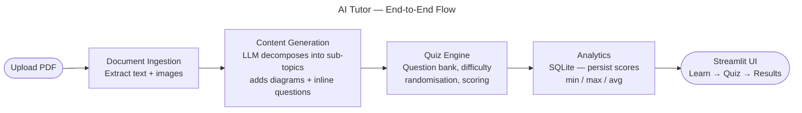

# AI Tutor

A web application that transforms static documents into interactive learning modules — with sub-topic decomposition, diagrams, inline questions, quizzes, and performance analytics.

## How It Works



## Features

- **Document Ingestion** — Upload PDF files (PPTX and DOCX coming soon). Text, structure, and embedded images are extracted automatically.
- **Content Generation** — Claude LLM decomposes the document into focused sub-topics with learner-friendly explanations, key takeaways, and Mermaid diagrams.
- **Inline Questions** — 2-3 reinforcement questions embedded in each sub-topic with immediate feedback.
- **Quizzes** — End-of-module quiz with selectable difficulty (easy / medium / hard), randomised questions, and per-question explanations.
- **Performance Analytics** — Score stored in SQLite; results page shows your score against the cohort min, max, and average with a percentile rank.

## Tech Stack

| Layer            | Technology                                              |
| ---------------- | ------------------------------------------------------- |
| Frontend         | [Streamlit](https://streamlit.io)                       |
| LLM              | Claude via Anthropic API or [Portkey](https://portkey.ai) gateway |
| Document Parsing | [PyMuPDF](https://pymupdf.readthedocs.io) (PDF)         |
| Database         | SQLite (`sqlite3` stdlib)                               |
| Package Manager  | [uv](https://docs.astral.sh/uv/)                        |
| Python           | 3.14+                                                   |

## Project Structure

```
course_project/
├── app.py                  # Streamlit entry point
├── ingestion/              # Stream 1 — Document parsing
├── content/                # Stream 2 — LLM content & diagram generation
├── quiz/                   # Stream 3 — Question bank, assembly, scoring
├── analytics/              # Stream 4 — SQLite persistence & cohort stats
├── frontend/               # Stream 5 — Streamlit UI pages
├── tests/                  # Unit tests + sample JSON fixtures
│   └── fixtures/           # sample_document.json, sample_module.json, …
└── data/                   # Runtime data (uploads, DB) — gitignored
```

See [SPEC.md](SPEC.md) for full interface contracts and work stream breakdown.
See [plan.md](plan.md) for the implementation plan and commit schedule.

## Setup

```bash
# Clone the repo
git clone git@github.com:bijesh-p/deepl-ai-tutor.git
cd deepl-ai-tutor

# Install dependencies
uv sync

# Copy and fill in environment variables
cp .env.example .env
# edit .env with your API keys

# Run the app
uv run streamlit run app.py
```

## Environment Variables

Copy `.env.example` to `.env` and fill in your values.

### Using Claude directly (Anthropic API)

```bash
AI_TUTOR_LLM_PROVIDER=anthropic
AI_TUTOR_LLM_API_KEY=your-anthropic-api-key
AI_TUTOR_LLM_MODEL=claude-opus-4-8
```

### Using Portkey gateway

```bash
AI_TUTOR_LLM_PROVIDER=portkey
AI_TUTOR_PORTKEY_API_KEY=your-portkey-api-key
AI_TUTOR_PORTKEY_VIRTUAL_KEY=your-portkey-virtual-key
AI_TUTOR_LLM_MODEL=claude-opus-4-8
```

### All variables

| Variable                       | Purpose                         | Default            |
| ------------------------------ | ------------------------------- | ------------------ |
| `AI_TUTOR_LLM_PROVIDER`        | `anthropic` or `portkey`       | `anthropic`        |
| `AI_TUTOR_LLM_API_KEY`         | Anthropic API key              | (required)         |
| `AI_TUTOR_LLM_MODEL`           | Claude model name              | `claude-opus-4-8`  |
| `AI_TUTOR_PORTKEY_API_KEY`     | Portkey API key                | (if portkey)       |
| `AI_TUTOR_PORTKEY_VIRTUAL_KEY` | Portkey virtual key for Claude | (if portkey)       |
| `AI_TUTOR_DB_PATH`             | SQLite database path           | `data/ai_tutor.db` |
| `AI_TUTOR_UPLOAD_DIR`          | Upload directory               | `data/uploads`     |
| `AI_TUTOR_MAX_FILE_MB`         | Max upload size in MB          | `50`               |

## Development

```bash
# Run all tests
uv run pytest tests/

# Run a specific stream's tests
uv run pytest tests/test_ingestion/
uv run pytest tests/test_content/
uv run pytest tests/test_quiz/
uv run pytest tests/test_analytics/

# Run a script directly
PYTHONPATH=. uv run python ingestion/pdf_parser.py
```

Each stream can be developed and tested independently using JSON fixtures in `tests/fixtures/` — no upstream streams need to be implemented first.
