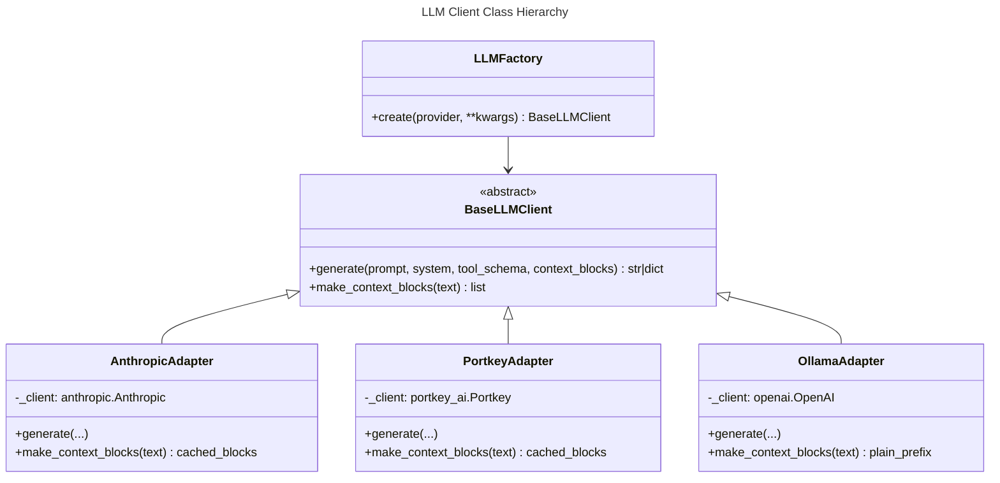

# SPEC.md — AI Tutor System Specification

> **Version:** 0.4 (Multi-LLM + MCP Servers + CrewAI Content Factory + LangGraph Adaptive Tutor)
> **Last updated:** 2026-06-09

---

## 0. Release Phases

| Phase | Name | Status | Key additions |
|-------|------|--------|---------------|
| 1 | PDF POC | ✅ Complete | Single-provider LLM, persistent module library |
| 2 | Platform Upgrade | 🔲 Next | Multi-LLM factory, MCP servers, CrewAI content generation, ChromaDB |
| 3 | Adaptive Tutor | 🔲 Future | LangGraph interactive tutor, adaptive difficulty, hints, mastery tracking |

---

### Phase 1 — PDF POC ✅ COMPLETE

Single Anthropic provider, PDF-only input, SQLite persistence, Streamlit frontend.

**Definition of done:** ✅ All items delivered.

---

### Phase 2 — Platform Upgrade (next)

**Goal:** Refactor the backend into a clean layered architecture — MCP tool servers, a multi-provider LLM factory, and a CrewAI-powered content generation crew. Adds ChromaDB for semantic retrieval and Portkey/Ollama as switchable LLM backends. Frontend retains all existing pages and styles.

**Scope:**
- Directory restructure: `backend/` + `mcp_servers/` as top-level packages
- LLM abstraction: strategy + factory pattern (`base.py`, `factory.py`, `adapters/`)
- MCP servers: `document_server`, `assessment_server`, `storage_server`
- Content generation replaced by CrewAI crew (`backend/content_factory/`) — 3 agents, sequential
- ChromaDB vector store for document chunks (`all-MiniLM-L6-v2`)
- Frontend: no admin/user separation; any user can upload and generate

**Definition of done for Phase 2:**
- [ ] `LLMFactory.create("portkey" | "ollama" | "anthropic")` returns a working client
- [ ] Three MCP servers each expose their tools and can be called via `mcp_client.py`
- [ ] CrewAI crew (3 agents) produces a `LearningModule` equivalent to Phase 1 output
- [ ] ChromaDB stores and retrieves document chunks by semantic similarity
- [ ] Upload page works end-to-end with the new CrewAI backend
- [ ] All existing Streamlit pages (module library, learn, quiz, results) work unchanged

---

### Phase 3 — Adaptive Tutor (future)

**Goal:** Replace the static learn → quiz → results flow with a LangGraph-powered conversational tutor that adapts in real time — adjusting difficulty, offering hints, and tracking topic mastery.

**Scope:**
- `backend/interactive_tutor/` — LangGraph state machine (5 nodes, conditional router)
- New frontend page: `tutor_room.py` (chat-style UI driven by `GraphState`)
- Mastery tracking persisted to SQLite via `SqliteSaver` checkpointer
- Targeted hint generation when student struggles (LLM-generated, tailored to specific error)
- Foundation simplification when student is stuck after max attempts

**Definition of done for Phase 3:**
- [ ] LangGraph graph compiles and executes the full `present_concept → ask_question → evaluate_response → (hint | simplify | next)` loop
- [ ] `GraphState` correctly tracks `attempts`, `concept_mastered`, and `mastered_concepts` per user
- [ ] Tutor Room page shows chat-style interaction and mastery progress
- [ ] `evaluate_response` identifies specific misconceptions, not just binary right/wrong
- [ ] `provide_hint` generates hints tailored to the student's specific error
- [ ] `simplify_foundations` breaks concept into building blocks after 3 failed attempts
- [ ] All mastery state is persisted so sessions can resume

---

## 1. System Overview

### 1.1 Problem

Static documents (PDFs, PowerPoint slides, Word docs) lead to passive learning and poor retention. Manually creating adaptive, interactive learning content is expensive, slow to update, and impossible to personalise at scale.

### 1.2 Solution

AI Tutor is a web platform that transforms uploaded documents into interactive, adaptive learning experiences:

1. **Any user** uploads a PDF → CrewAI multi-agent crew (3 agents, sequential) generates a structured learning module and stores it persistently.
2. **Users** browse the module library → work through enriched content and take quizzes.
3. **Adaptive Tutor** (Phase 3) watches user responses and adjusts difficulty, provides targeted hints, simplifies foundations when students are stuck, and tracks topic mastery via a LangGraph state machine (5 nodes, conditional routing).

### 1.3 High-Level Architecture

See [ARCHITECTURE.md](ARCHITECTURE.md) for detailed diagrams. Summary:

```
Streamlit Frontend
    ├── Upload & Generate ──→ CrewAI Crew (3 agents) ──→ SQLite + ChromaDB
    ├── Module Library / Viewer / Quiz / Results ──→ SQLite
    └── Tutor Room (Phase 3) ──→ LangGraph Graph (5 nodes) ──→ SQLite + ChromaDB
                                                     ↕
                                              MCP Tool Servers
                                              (document, assessment, storage)
                                                     ↕
                                               LLMFactory
                                         (anthropic | portkey | ollama)
```

### 1.5 Tech Stack

| Layer | Technology | Phase |
|---|---|---|
| Frontend | Streamlit (multi-page) | 1+ |
| Content generation | CrewAI | 2 |
| Adaptive tutor | LangGraph | 3 |
| LLM providers | Anthropic SDK, Portkey, Ollama (OpenAI-compat) | 1 / 2 / 2 |
| Tool protocol | MCP (Model Context Protocol) | 2 |
| Vector store | ChromaDB + `sentence-transformers` (`all-MiniLM-L6-v2`) | 2 |
| Relational DB | SQLite (`sqlite3` stdlib) | 1+ |
| Document parsing | PyMuPDF (PDF only in Phase 2) | 1+ |
| Diagrams | Mermaid (LLM-generated) | 1+ |
| Package manager | `uv` | 1+ |
| Python | 3.14+ | 1+ |

---

## 2. Directory Structure

```
ai-tutor-platform/
│
├── .env.example                        # All env var templates
├── README.md                           # Setup, architecture, quickstart
├── pyproject.toml                      # Unified dependencies (uv)
├── SPEC.md
├── CLAUDE.md
│
├── mcp_servers/                        # TOOL LAYER — MCP microservices
│   ├── README.md                       # How to run each server standalone
│   ├── document_server.py              # Tools: extract_text_from_pdf, parse_images
│   ├── assessment_server.py            # Tools: validate_json_schema, evaluate_taxonomy
│   └── storage_server.py              # Tools: upsert_to_vector_db, save_module_to_db
│
├── backend/                            # CORE LOGIC LAYER
│   ├── core/
│   │   ├── __init__.py
│   │   ├── mcp_client.py              # Helper to discover and call MCP tools
│   │   └── llm_client/               # Provider factory + adapters
│   │       ├── __init__.py
│   │       ├── base.py               # Abstract BaseLLMClient
│   │       ├── factory.py            # LLMFactory.create(provider) -> BaseLLMClient
│   │       └── adapters/
│   │           ├── __init__.py
│   │           ├── anthropic_adapter.py
│   │           ├── portkey_adapter.py
│   │           └── ollama_adapter.py
│   │
│   ├── ingestion/                     # Document parsers (moved from top-level)
│   │   ├── __init__.py
│   │   ├── models.py                  # Document, Section, ExtractedImage dataclasses
│   │   ├── pdf_parser.py
│   │   ├── pptx_parser.py             # Phase 2
│   │   ├── docx_parser.py             # Phase 2
│   │   └── image_extractor.py
│   │
│   ├── content/                       # Content models + legacy pipeline (Phase 1 compat)
│   │   ├── __init__.py
│   │   └── models.py                  # LearningModule, EnrichedTopic, Topic, Diagram, Question
│   │
│   ├── content_factory/               # CONTENT GENERATION — CrewAI crew
│   │   ├── __init__.py
│   │   ├── agents.py                  # Agent definitions (roles, goals, backstories)
│   │   ├── tasks.py                   # Task sequences: Ingest → Outline → Enrich → Quiz
│   │   ├── crew.py                    # Assembles and runs the crew
│   │   └── pipeline.py                # Public entry point: run_pipeline(file_path) -> LearningModule
│   │
│   ├── interactive_tutor/             # ADAPTIVE TUTOR — LangGraph
│   │   ├── __init__.py
│   │   ├── state.py                   # GraphState TypedDict
│   │   ├── nodes.py                   # 5 nodes: present_concept, ask_question, evaluate_response, provide_hint, simplify_foundations
│   │   └── graph.py                   # Compile graph with conditional router
│   │
│   ├── quiz/                          # Quiz engine (unchanged from Phase 1)
│   │   ├── __init__.py
│   │   ├── models.py
│   │   ├── question_bank.py
│   │   ├── difficulty.py
│   │   ├── assembler.py
│   │   └── evaluator.py
│   │
│   └── analytics/                     # Persistence + stats (unchanged from Phase 1)
│       ├── __init__.py
│       ├── db.py
│       ├── models.py
│       ├── persistence.py
│       └── stats.py
│
├── frontend/                          # PRESENTATION LAYER
│   ├── app.py                         # Entry point, session init, router
│   ├── upload_page.py                 # Upload PDF + trigger CrewAI generation
│   ├── module_library_page.py
│   ├── module_viewer.py
│   ├── quiz_page.py
│   ├── results_page.py
│   ├── demo_mode.py
│   ├── tutor_room.py                  # Adaptive tutor chat UI (Phase 3)
│   └── utils/
│       └── session_manager.py         # Bridges GraphState ↔ st.session_state
│
├── tests/
│   ├── test_ingestion/
│   ├── test_content/
│   ├── test_quiz/
│   ├── test_analytics/
│   ├── test_llm_client/
│   ├── test_mcp/
│   └── fixtures/
│       ├── sample.pdf
│       ├── sample_document.json
│       ├── sample_module.json
│       ├── sample_bank.json
│       ├── sample_result.json
│       └── sample_stats.json
│
└── data/                              # Runtime data (gitignored)
    ├── uploads/
    ├── generated/
    ├── ai_tutor.db
    └── chroma/                        # ChromaDB persistent store
```

---

## 3. MCP Tool Servers

MCP servers are standalone processes that expose tools over the Model Context Protocol. Agents (CrewAI, LangGraph) discover and call these tools through `backend/core/mcp_client.py`. This decouples tool logic from the orchestration layer — a tool can be called by a CrewAI agent, a LangGraph node, or a plain Python function without changing its implementation.

### 3.1 document_server (`mcp_servers/document_server.py`)

**Purpose:** All document I/O operations. Called by the Information Architect agent.

| Tool | Signature | Description |
|---|---|---|
| `extract_text_from_pdf` | `(file_path: str, max_pages: int) -> list[SectionDict]` | Parse PDF, return sections with title + body |
| `parse_images` | `(file_path: str, output_dir: str) -> list[ImageDict]` | Extract embedded images, save as PNG |

### 3.2 assessment_server (`mcp_servers/assessment_server.py`)

**Purpose:** Validate and evaluate generated content. Called by the Assessment Designer agent and the LangGraph `evaluate_response` node.

| Tool | Signature | Description |
|---|---|---|
| `validate_json_schema` | `(data: dict, schema_name: str) -> ValidationResult` | Assert output matches expected schema (LearningModule, QuestionBank, etc.) |
| `evaluate_taxonomy` | `(question: dict) -> TaxonomyTag` | Tag a question with Bloom's taxonomy level (recall/understand/apply/analyse) |

### 3.3 storage_server (`mcp_servers/storage_server.py`)

**Purpose:** Persist data to SQLite and ChromaDB. Called by the Formatting Specialist agent.

| Tool | Signature | Description |
|---|---|---|
| `upsert_to_vector_db` | `(texts: list[str], metadata: list[dict], collection: str) -> None` | Embed and store chunks in ChromaDB |
| `save_module_to_db` | `(module_json: str, bank_json: str, created_by: str) -> str` | Persist module + bank to SQLite, return `module_id` |
| `query_vector_db` | `(query: str, collection: str, n_results: int) -> list[dict]` | Semantic search over stored chunks |

### 3.4 MCP Client (`backend/core/mcp_client.py`)

Thin wrapper that starts/connects to MCP servers and dispatches tool calls:

```python
class MCPClient:
    def call(self, server: str, tool: str, **kwargs) -> dict: ...
    def list_tools(self, server: str) -> list[str]: ...
```

---

## 4. LLM Client — Factory + Adapter Pattern

### 4.1 Design



### 4.2 Abstract Interface (`backend/core/llm_client/base.py`)

```python
from abc import ABC, abstractmethod

class BaseLLMClient(ABC):
    @abstractmethod
    def generate(
        self,
        prompt: str,
        system: str | None = None,
        tool_schema: dict | None = None,   # Anthropic tool format; adapters translate internally
        context_blocks: list | None = None, # Pre-built context; degraded gracefully for Ollama
    ) -> str | dict: ...

    def make_context_blocks(self, text: str) -> list:
        """Return provider-appropriate context structure (cached blocks or plain list)."""
        ...
```

### 4.3 Factory (`backend/core/llm_client/factory.py`)

```python
class LLMFactory:
    @staticmethod
    def create(
        provider: str | None = None,   # reads AI_TUTOR_LLM_PROVIDER if None
        **kwargs,                       # api_key, model, portkey_virtual_key, ollama_base_url
    ) -> BaseLLMClient: ...
```

### 4.4 Adapters

| Adapter | SDK | Tool schema format | Caching |
|---|---|---|---|
| `AnthropicAdapter` | `anthropic` | Anthropic native (`input_schema`) | `cache_control` blocks |
| `PortkeyAdapter` | `portkey_ai` | Anthropic native (Portkey mirrors SDK) | `cache_control` blocks |
| `OllamaAdapter` | `openai` (compat) | OpenAI function format (translated internally) | No caching; context_blocks flattened to text prefix |

**Schema translation (Anthropic → OpenAI)** happens inside `OllamaAdapter` — callers always pass Anthropic-format tool schemas:

```python
# Caller passes this (Anthropic format):
{"name": "output", "description": "...", "input_schema": {"type": "object", "properties": {...}}}

# OllamaAdapter translates to:
{"type": "function", "function": {"name": "output", "description": "...", "parameters": {...}}}
```

### 4.5 Environment Variables

| Variable | Purpose | Default |
|---|---|---|
| `AI_TUTOR_LLM_PROVIDER` | `anthropic` \| `portkey` \| `ollama` | `anthropic` |
| `AI_TUTOR_LLM_API_KEY` | Anthropic API key or Portkey API key | (required) |
| `AI_TUTOR_LLM_MODEL` | Model string (provider-specific) | `claude-sonnet-4-6` |
| `AI_TUTOR_PORTKEY_VIRTUAL_KEY` | Portkey virtual key (routes to backend model) | — |
| `AI_TUTOR_OLLAMA_BASE_URL` | Ollama server URL | `http://localhost:11434` |

---

## 5. Work Stream 1: Document Ingestion

*(Unchanged from v0.3 — moved to `backend/ingestion/`. See §7.1 for data contracts.)*

**Phase 2 scope:** PDF only. PPTX and DOCX parsers (`pptx_parser.py`, `docx_parser.py`) are deferred to Phase 3.

---

## 6. Work Stream 2: Content Generation — CrewAI Factory

### 6.1 Goal

Replace the sequential single-LLM pipeline with a CrewAI multi-agent crew. Three specialised agents run in sequence (`Process.sequential`), each calling appropriate MCP tool servers. The crew produces the same `LearningModule` output as Phase 1, with higher quality from specialisation.

### 6.2 Agents (`backend/content_factory/agents.py`)

| Agent | Role | Backstory | MCP tools used |
|---|---|---|---|
| **Information Architect** | Document analyst + curriculum designer | Expert at extracting structure from documents and decomposing them into a coherent learning sequence | `document_server`: `extract_text_from_pdf`, `parse_images` |
| **Assessment Designer** | Question author + difficulty tagger | Experienced educator who writes questions at multiple cognitive levels (Bloom's taxonomy) | `assessment_server`: `evaluate_taxonomy` |
| **Formatting Specialist** | Content writer + publisher | Turns raw outlines into polished learner-friendly Markdown with diagrams, validates schema, and persists the result | `storage_server`: `upsert_to_vector_db`, `save_module_to_db` |

### 6.3 Task Sequence (`backend/content_factory/tasks.py`)

```
Information Architect
    → Extract text + images from PDF via document_server
    → Decompose into ordered learning topics with scope boundaries
    → Output: list[Topic] with source section mapping

Assessment Designer
    → Generate 2-3 inline questions per topic (SCQ/MCQ)
    → Build full quiz question bank (20-50 questions)
    → Tag each question with difficulty + Bloom's level via assessment_server
    → Output: list[EnrichedTopic] with inline_questions + QuestionBank

Formatting Specialist
    → Rewrite content into learner-friendly Markdown with analogies and key takeaways
    → Generate Mermaid diagrams for topics that benefit from a visual
    → Validate output against LearningModule schema
    → Persist module JSON to SQLite and embed topic chunks in ChromaDB via storage_server
    → Output: module_id
```

### 6.4 Public Entry Point (`backend/content_factory/pipeline.py`)

```python
def run_pipeline(file_path: str, user_id: str) -> str:
    """Run the CrewAI crew and return the module_id of the saved module."""
```

Called by `frontend/upload_page.py` — the frontend does not import any CrewAI types directly.

### 6.5 ChromaDB Integration

After the crew completes, the Formatting Specialist calls `storage_server.upsert_to_vector_db` with:
- **Collection:** `modules`
- **Documents:** One chunk per `EnrichedTopic` (content + key takeaways concatenated)
- **Metadata:** `{"module_id": ..., "topic_id": ..., "title": ...}`
- **Embedding function:** `SentenceTransformerEmbeddingFunction(model_name="all-MiniLM-L6-v2")` — runs locally, no API call

This enables semantic search in Phase 3 (LangGraph tutor retrieves relevant topic context dynamically).

---

## 7. Work Stream 3: Adaptive Tutor — LangGraph

### 7.1 Goal

A conversational tutor that watches each student response, analyses their specific misconceptions (not just binary right/wrong), provides targeted hints, and falls back to foundational re-teaching when the student is stuck. Tracks topic mastery across a session. Complements (not replaces) the static quiz flow.

### 7.2 Graph State (`backend/interactive_tutor/state.py`)

The single source of truth passed between every node:

```python
from typing import TypedDict, Annotated
from langgraph.graph.message import add_messages

class GraphState(TypedDict):
    # Identity
    user_id: str
    module_id: str

    # Current position
    current_concept: str            # topic_id currently being taught
    concept_content: str            # enriched content retrieved from ChromaDB
    current_question: dict | None   # active question awaiting answer

    # Tracking
    attempts: int                   # attempts on current concept (reset per concept)
    concept_mastered: bool          # set by evaluate_response
    mastered_concepts: list[str]    # accumulates across session

    # Conversation
    chat_history: Annotated[list, add_messages]
```

### 7.3 Nodes (`backend/interactive_tutor/nodes.py`)

Five node functions — each is a plain Python function that receives `GraphState` and returns a partial state update:

| Node | What it does |
|---|---|
| `present_concept` | Loads concept content from ChromaDB via `storage_server.query_vector_db`. Delivers a clear explanation to the student. Resets `attempts=0` and `concept_mastered=False`. |
| `ask_question` | Calls LLM to generate a targeted question assessing the current concept. Sets `current_question`. |
| `evaluate_response` | Calls LLM to analyse the student's answer — checks for **specific misconceptions**, not just binary right/wrong. Increments `attempts`. Sets `concept_mastered=True` if the response demonstrates understanding. |
| `provide_hint` | Called when the student struggles. Calls LLM to generate a hint **tailored to their specific error** (from the evaluation). Does not reveal the answer. |
| `simplify_foundations` | Called when the student is stuck after max attempts. Breaks the concept into simpler building blocks and re-teaches from basics. Resets `attempts=0` for a fresh approach. |

### 7.4 Conditional Router

After `evaluate_response`, a router function inspects state and decides the next node:

```
if concept_mastered:
    → are there more concepts?
        yes → present_concept (next concept)
        no  → END (session complete, persist mastery)
elif attempts < 3:
    → provide_hint → ask_question (retry with guidance)
else:
    → simplify_foundations → ask_question (fresh approach from basics)
```

### 7.5 Graph Flow

See [ARCHITECTURE.md §4](ARCHITECTURE.md) for the full state machine diagram. Summary:

```
present_concept → ask_question → [wait for answer] → evaluate_response
                                                            │
                                        ┌───────────────────┼───────────────────┐
                                        ▼                   ▼                   ▼
                                   mastered             attempts < 3       attempts >= 3
                                        │                   │                   │
                                  next concept         provide_hint    simplify_foundations
                                  (or END)                  │                   │
                                                       ask_question        ask_question
```

### 7.6 Mastery Persistence

A new `topic_mastery` table tracks per-user per-topic state across sessions:

```sql
CREATE TABLE IF NOT EXISTS topic_mastery (
    user_id       TEXT NOT NULL REFERENCES users(user_id),
    module_id     TEXT NOT NULL REFERENCES modules(module_id),
    topic_id      TEXT NOT NULL,
    mastered      INTEGER NOT NULL DEFAULT 0,   -- 0 or 1
    difficulty    TEXT NOT NULL DEFAULT 'easy',
    attempts      INTEGER NOT NULL DEFAULT 0,
    last_updated  TEXT NOT NULL DEFAULT (datetime('now')),
    PRIMARY KEY (user_id, module_id, topic_id)
);
```

---

## 8. Work Stream 4: Quiz Engine

*(Unchanged from v0.3 — moved to `backend/quiz/`. See §11.3 for data contracts.)*

The quiz engine continues to serve the static difficulty-select → quiz → results flow (frontend pages unchanged). In Phase 3, the LangGraph tutor generates questions dynamically and does not use the assembler; the question bank remains available for users who prefer the traditional quiz mode.

---

## 9. Work Stream 5: Data & Analytics

*(Core schema unchanged — `backend/analytics/`. New additions below.)*

### 9.1 New: ChromaDB (`data/chroma/`)

| Collection | Contents | Used by |
|---|---|---|
| `modules` | Topic content chunks, one per `EnrichedTopic` | LangGraph `ask_question` node (context retrieval) |
| `sessions` | Per-session tutor messages (Phase 3) | LangGraph hint/escalation context |

ChromaDB is accessed through `storage_server` MCP tools — nothing in the frontend or CrewAI crew imports `chromadb` directly.

### 9.2 New: `topic_mastery` table

Described in §7.6.

### 9.3 Analytics additions (Phase 3)

New `analytics/stats.py` functions:
- `get_mastery_report(user_id, module_id) -> MasteryReport` — per-topic mastery, attempts, final difficulty reached
- `get_cohort_mastery(module_id) -> CohortMastery` — average mastery rate per topic across all users

---

## 10. Work Stream 6: Frontend (Streamlit)

### 10.1 Design Principles (carried from Phase 1)

- Sidebar TOC in module viewer
- Collapsible `st.expander` per topic
- Mermaid diagram rendering (via `streamlit-mermaid`, fallback to `st.code`)
- Inline questions with immediate feedback (`st.radio`/`st.checkbox`)
- Cohort analytics bar chart on results page
- Demo mode toggle for exploring the GUI without LLM

### 10.2 Page Inventory

No admin/user role separation — any user can upload and generate modules.

| Page | File | Purpose |
|---|---|---|
| Upload | `frontend/upload_page.py` | Enter username, upload PDF, trigger CrewAI pipeline via `run_pipeline()` |
| Module Library | `frontend/module_library_page.py` | Browse all published modules, select one to learn or delete |
| Module Viewer | `frontend/module_viewer.py` | Read topics, inline questions, Mermaid diagrams, "Take Quiz" button |
| Quiz | `frontend/quiz_page.py` | Difficulty selector, question form, submit |
| Results | `frontend/results_page.py` | Score, cohort bar chart, per-question breakdown, retake/back buttons |
| Tutor Room | `frontend/tutor_room.py` | Chat-style adaptive tutor (Phase 3). LangGraph graph invoked per user turn; state checkpointed via `SqliteSaver` |
| Demo Mode | `frontend/demo_mode.py` | Sidebar toggle — loads fixture JSON, bypasses pipeline |

### 10.3 Navigation

```
[upload] ──→ [module_library]
                  │
           ┌──────┴──────┐
           ▼              ▼
        [learn]      [tutor_room]  ◀── Phase 3
           │              │
           ▼         (adaptive loop)
        [quiz]
           │
           ▼
        [results]
           │
           └──→ [module_library]
```

### 10.4 Tutor Room UI (Phase 3)

- `frontend/utils/session_manager.py` — bridges `GraphState` to `st.session_state`; handles graph invocation and message streaming
- LangGraph graph is invoked per user turn; full state is checkpointed via `SqliteSaver`
- UI shows: current concept, mastery progress bar, chat-style conversation, answer input

---

## 11. Interface Contracts

### 11.1 Document Model (`backend/ingestion/models.py`)

```python
@dataclass
class ExtractedImage:
    image_id: str; file_path: str; caption: str | None; source_location: str

@dataclass
class Section:
    section_id: str; title: str; body: str; level: int
    images: list[ExtractedImage] = field(default_factory=list)
    metadata: dict = field(default_factory=dict)

@dataclass
class Document:
    doc_id: str; title: str; source_filename: str
    source_type: SourceType; sections: list[Section]; total_pages: int
```

### 11.2 Learning Module (`backend/content/models.py`)

```python
@dataclass
class Topic:
    topic_id: str; title: str; summary: str
    source_section_ids: list[str]; order: int

@dataclass
class Diagram:
    diagram_id: str; diagram_type: str  # "mermaid" | "extracted_image"
    content: str; caption: str

@dataclass
class Question:
    question_id: str; question_text: str
    question_type: str  # "single_choice" | "multiple_choice"
    options: list[str]; correct_answers: list[int]
    explanation: str; difficulty: str  # "easy" | "medium" | "hard"

@dataclass
class EnrichedTopic:
    topic: Topic; content_md: str; key_takeaways: list[str]
    diagrams: list[Diagram]; inline_questions: list[Question]

@dataclass
class LearningModule:
    module_id: str; title: str; source_doc_id: str
    topics: list[EnrichedTopic]; created_at: str

    def to_json(self) -> str: ...
    @classmethod
    def from_json(cls, data: str | dict) -> LearningModule: ...
```

### 11.3 Quiz Model (`backend/quiz/models.py`)

```python
@dataclass
class QuizQuestion:
    question_id: str; question_text: str; question_type: str
    options: list[str]; correct_answers: list[int]
    explanation: str; difficulty: str; topic_id: str

@dataclass
class QuestionBank:
    module_id: str; questions: list[QuizQuestion]

@dataclass
class Quiz:
    quiz_id: str; module_id: str; difficulty: str
    questions: list[QuizQuestion]; created_at: str

@dataclass
class AnswerResult:
    question_id: str; selected: list[int]; correct: list[int]
    is_correct: bool; explanation: str

@dataclass
class QuizResult:
    quiz_id: str; module_id: str; user_id: str
    score: int; total: int; percentage: float
    answers: list[AnswerResult]; completed_at: str
```

### 11.4 Analytics Model (`backend/analytics/models.py`)

```python
@dataclass
class ModuleStats:
    module_id: str; total_attempts: int
    min_score: float; max_score: float; avg_score: float
    user_score: float; user_percentile: float; user_attempts: int

@dataclass
class MasteryReport:          # Phase 3
    user_id: str; module_id: str
    topics: list[dict]         # [{topic_id, title, mastered, difficulty, attempts}]
    overall_mastery_pct: float
```

---

## 12. Non-Functional Requirements

### 12.1 File Constraints
- Max upload: 50 MB
- Formats: `.pdf` (Phase 1 + Phase 2); `.pptx` `.docx` deferred to Phase 3

### 12.2 LLM Usage
- All LLM calls go through `BaseLLMClient` — no direct SDK imports outside `adapters/`
- Token budget per module generation: 200,000 tokens (input + output, configurable)
- Timeout per call: 60 seconds; retry once on transient failure

### 12.3 Performance
- PDF parsing: < 30 s for 50-page document
- CrewAI generation: 2-5 minutes — progress shown via `st.status()`
- Quiz assembly (no LLM): < 1 s
- LangGraph node invocation: < 10 s per turn
- ChromaDB query: < 500 ms

### 12.4 Error Handling
- Parse failures → surface file-specific error; allow re-upload
- LLM failure → retry once; show user-facing error with retry button
- CrewAI agent failure → log full traceback; surface which agent failed
- LangGraph graph error → reset session; offer restart from last checkpoint

### 12.5 Security
- No passwords — username-only identification (sufficient for course project scope)
- Uploaded files stored locally, scoped by `doc_id`; not publicly accessible
- API keys read from env; never logged or committed to source

---

## 13. Open Questions

- [x] **CrewAI process type** — **Resolved:** `Process.sequential`. Each task's output feeds the next; no parallel branches needed.
- [x] **ChromaDB embedding model** — **Resolved:** Local `sentence-transformers` (`all-MiniLM-L6-v2`). Fully offline, no API cost, fast on CPU. Configured via `chromadb.utils.embedding_functions.SentenceTransformerEmbeddingFunction`. Add `sentence-transformers` to `pyproject.toml`.
- [x] **LangGraph checkpointer** — **Resolved:** `SqliteSaver` (built-in, single file, zero extra infra).
- [x] **PPTX/DOCX priority** — **Resolved:** PDF only for Phase 2. PPTX/DOCX deferred to Phase 3.
- [x] **Hint generation strategy** — **Resolved:** LLM-generated at runtime inside `provide_hint` node. The LLM receives the question + topic context + evaluation of the student's specific error, and generates a targeted hint. No pre-stored hints.

---

## Appendix A: Environment Variables

| Variable | Purpose | Default |
|---|---|---|
| `AI_TUTOR_LLM_PROVIDER` | `anthropic` \| `portkey` \| `ollama` | `anthropic` |
| `AI_TUTOR_LLM_API_KEY` | Anthropic or Portkey API key | (required) |
| `AI_TUTOR_LLM_MODEL` | Model name | `claude-sonnet-4-6` |
| `AI_TUTOR_PORTKEY_VIRTUAL_KEY` | Portkey virtual key | — |
| `AI_TUTOR_OLLAMA_BASE_URL` | Ollama server URL | `http://localhost:11434` |
| `AI_TUTOR_DB_PATH` | SQLite file path | `data/ai_tutor.db` |
| `AI_TUTOR_UPLOAD_DIR` | Upload directory | `data/uploads` |
| `AI_TUTOR_MAX_FILE_MB` | Max upload size | `50` |
| `AI_TUTOR_CHROMA_PATH` | ChromaDB persistence directory | `data/chroma` |
| `AI_TUTOR_TOKEN_BUDGET` | Max tokens per generation run | `200000` |
