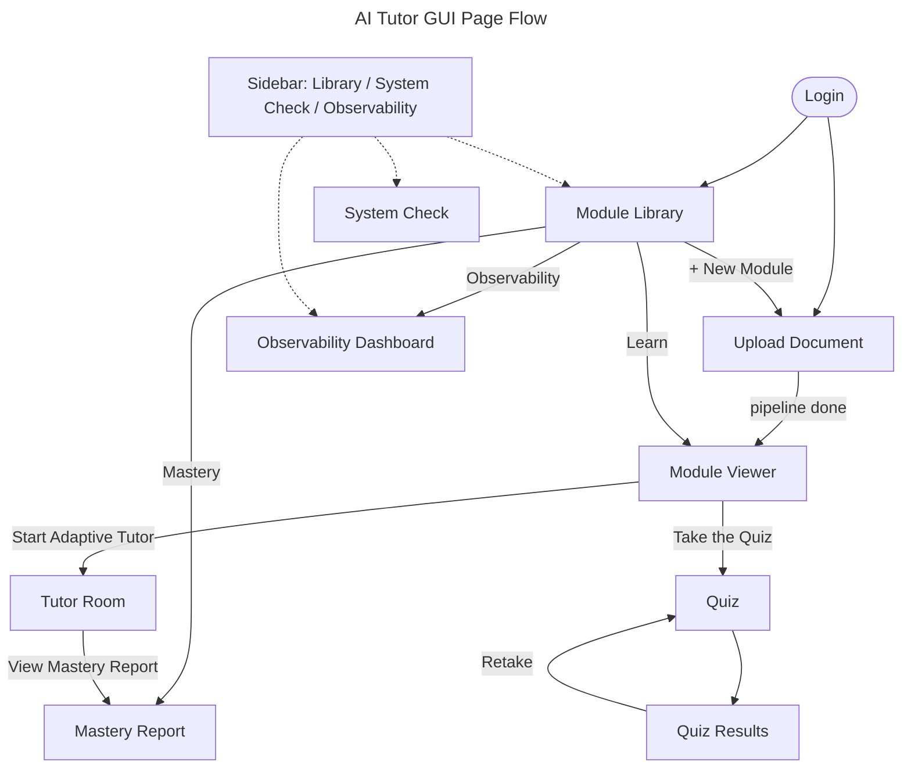

# GUI Specification — AI Tutor

Authoritative specification for the AI Tutor GUI / frontend.
[`SPEC.md`](SPEC.md) references this file for all GUI/frontend requirements.

- **Framework:** Streamlit (single-page app with `st.session_state["page"]` routing).
- **Entry point:** [`app.py`](app.py) — `uv run streamlit run app.py`.
- **Styling:** Centralized in [`frontend/styles.py`](frontend/styles.py).

---

## 1. Navigation

---

## 2. Global Shell — [`app.py`](app.py)

### 2.1 Sidebar

- [x] App branding (📚 AI Tutor) and user badge (username + Admin/Student role label)
- [x] Sign out button
- [x] **Model** section: provider selector (anthropic / portkey / ollama), model dropdown (dynamic for Ollama via `/api/tags`, static otherwise), text-input fallback when model list is empty
- [x] **Settings** section: four `st.button` toggle controls matching sidebar nav height (32 px)
  - [x] 🔊 Audio · on/off (TTS narration)
  - [x] 📡 Tracing · on/off (OTEL)
  - [x] 🧪 Evals · on/off (DeepEval)
  - [x] 🌙 Dark mode · on/off (persisted per-user via `save_dark_mode()`)
- [x] **Navigate** section: `+ New Module`, `📚 Library`, `🩺 System Check`, `📊 Observability`
- [x] Sidebar hidden entirely on the login page
- [x] Custom always-visible sidebar collapse/expand button (iframe workaround — [`frontend/sidebar_toggle.py`](frontend/sidebar_toggle.py))
- [ ] Validate model text-input and surface inline error for unknown models
- [ ] Make active provider/model clickable to jump to System Check
- [ ] Replace fragile iframe sidebar toggle with a stable documented approach

### 2.2 Global Pipeline Banner

- [x] Non-upload pages show a live info banner while the content pipeline runs: `{icon} {label} · {elapsed}s`
- [x] States covered: parsing / enriching / quiz / saving

### 2.3 Theming

- [x] Dark theme is the default — seeded at startup via `st.session_state.setdefault("dark_mode", True)` before any page renders (no flash of light theme)
- [x] Dark theme injected globally by `inject_global_css()` in [`frontend/styles.py`](frontend/styles.py); active on every page including login
- [x] Per-user dark mode toggle in sidebar; preference persisted to SQLite profile
- [x] On login, saved dark preference restored (`profile.get("dark_mode", True)`); new users default to dark
- [x] All HTML component helpers accept `dark: bool` and render dark or light palette accordingly
- [x] `config.toml` left at light base (Streamlit native widgets); dark theme applied entirely via CSS injection
- [ ] Light theme option via env/config flag for development

### 2.4 Button Consistency

- [x] All multi-button rows use equal-width `st.columns` with `use_container_width=True`
- [x] Shared height token: `.stButton button { min-height: 32px; padding: 5px 12px }` in `_GLOBAL_CSS`
- [x] Primary/secondary buttons differ only in color, not size
- [x] Settings toggle buttons match nav button height (32 px)
- [ ] Extract sizing tokens into a Python constant shared by CSS and HTML helpers

### 2.5 Streamlit Chrome

- [x] `#MainMenu` hidden
- [x] `[data-testid="stToolbar"]` hidden
- [x] `[data-testid="stDecoration"]` hidden
- [x] `[data-testid="stStatusWidget"]` hidden
- [x] `.stAppToolbar` / `[data-testid="stAppToolbar"]` hidden
- [x] `[data-testid="stHeader"]` / `header.stAppHeader` hidden (eliminates white strip at top of all pages)
- [x] Provider/model caption removed from main area (visible in sidebar only)

---

## 3. Pages

### 3.1 Login — [`frontend/login_page.py`](frontend/login_page.py)

- [x] Full-viewport dark gradient canvas (`#1E1B4B → #0F1117`)
- [x] Centered card (`#1A1D29`, `border: 1px solid #2D2F3D`)
- [x] Sidebar and all Streamlit toolbar/header chrome hidden
- [x] **User** tab: username-only login (password field shown but disabled)
- [x] **Admin** tab: username + password validated via `check_admin_password` / `is_admin_username`
- [x] Last username cached and pre-populated
- [x] LLM provider/model and dark-mode preference restored from profile on login
- [x] New users default to dark mode
- [x] Indigo-gradient brand title; dark inputs (`background: #0F1117`); slate secondary text
- [ ] Hide disabled password field on User tab (currently visible but non-functional)
- [ ] Styled error state for failed admin login
- [ ] Lightweight account creation / first-run guidance

### 3.2 System Check — [`frontend/system_check_page.py`](frontend/system_check_page.py)

- [x] LLM connectivity test with masked API keys and success/error display with traceback
- [x] Result cached 120 s with a **Re-test Connection** button
- [x] Component checks: database, Ollama server (`/api/tags`), package versions
- [x] `uv add <pkg>` hints for missing packages
- [ ] Collapse long tracebacks behind an expander
- [ ] Explicit timeout feedback when a check hangs
- [ ] Link to `.env` setup docs; suggest `ollama pull` when no models are present

### 3.3 Upload — [`frontend/upload_page.py`](frontend/upload_page.py)

- [x] Dark-aware `page_header_html` banner
- [x] File uploader for `.pdf`, `.pptx`, `.docx`, `.vtt` inside `st.form`
- [x] Cached-file reuse notice
- [x] **Start Learning** primary action button
- [x] Animated `step_progress_html` pipeline progress bar (Upload → Parse → Generate Slides → Quiz → Save), dark-aware
- [x] Parsing state: `parsing_status_html` — spinning doc icon, wave bars, elapsed time, dark-aware
- [x] Enriching state: `slide_chips_html` (done/current chips) + `skeleton_slide_html` shimmer card + ETA caption + abort button, dark-aware
- [x] Quiz state: `quiz_generating_html` — animated purple card with wave bars, dark-aware
- [x] Saving state: `saving_status_html` — green animated save card, dark-aware
- [x] Background pipeline: parse → LLM → enrichment → quiz bank → save → redirect
- [x] Structured user-facing errors for parse/connection/enrichment failures with partial recovery
- [ ] Validate file size and type before submission; show page count
- [ ] Estimated total time before first status update
- [ ] Cancel action accessible from the global banner (not only the progress UI)
- [ ] Resume-after-refresh support for pipeline progress
- [ ] Actionable error messages (e.g., "scanned PDF — try OCR'd file")

### 3.4 Module Library — [`frontend/module_library_page.py`](frontend/module_library_page.py)

- [x] **My Modules** section with dark-aware `module_card_html` cards (title, source, date, Published badge)
- [x] 4-column equal-width action row per card: `Learn` / `Mastery` / `Delete` / `Publish` (Publish visible to admins only)
- [x] Dark-aware empty-state panel when no modules exist
- [x] **Shared Library** section: admin-published modules with `Learn` action
- [x] Dark-aware empty-state panel for shared library
- [x] Welcome subtitle uses dark-responsive color
- [x] Auto-rerun every ~3 s while a pipeline runs
- [ ] Confirmation dialog before Delete (currently immediate and irreversible)
- [ ] Search, filter, and sort controls
- [ ] Warning when opening Mastery for a module with no tutor sessions yet

### 3.5 Module Viewer — [`frontend/module_viewer.py`](frontend/module_viewer.py)

- [x] Per-topic `st.tabs` with concept info, audio narration, Mermaid diagram (with `st.info` fallback), Markdown content, key takeaways
- [x] Inline single-choice radio questions (locked after answer) with correct/incorrect feedback and explanations
- [x] Inline multi-choice checkbox questions with **Check** button
- [x] **Start Adaptive Tutor** and **Take the Quiz** buttons (quiz disabled until bank is ready)
- [x] Live progress fragment (every ~3 s) while topics are generating
- [ ] Persist inline-question correctness across reruns/sessions
- [ ] Clear "quiz still generating" indicator instead of only disabling the button
- [ ] Preserve original content when a Mermaid diagram fails to render
- [ ] Guidance on whether to start tutor or quiz first

### 3.6 Quiz — [`frontend/quiz_page.py`](frontend/quiz_page.py)

- [x] Dark-aware `page_header_html` banner
- [x] Difficulty selector: three dark-aware cards (Easy / Medium / Hard) with selected-state styling
- [x] Selected difficulty persisted in session state; button label shows `✓` when selected
- [x] Question progress bar and dark-aware dot navigator (answered / current / unanswered)
- [x] Dark-aware `question_card_html` per question with type badge (Single / Multi choice)
- [x] Full-width option cards with A/B/C/D letter badges for radio and checkbox inputs
- [x] Dark-aware quiz header (title, difficulty badge, answered/remaining counts, question number)
- [x] Answer state persisted across navigation
- [x] `Previous` / `Next` / `Submit` buttons in equal-width columns
- [ ] Clickable dot navigator for direct question jumps
- [ ] Unanswered-questions confirmation on submit
- [ ] Optional per-attempt timer

### 3.7 Quiz Results — [`frontend/results_page.py`](frontend/results_page.py)

- [x] Dark-aware `score_banner_html` circular score ring with tiered grade text and color (teal / green / amber / red on dark backgrounds)
- [x] Cohort comparison: percentile + You/Average/Min/Max bar chart (shown once ≥ 2 attempts exist)
- [x] Per-question expanders with answer markers and explanations
- [x] **Download report** (plain text) and **Retake Quiz** buttons
- [ ] Collapse per-question expanders by default for long quizzes
- [ ] CSV/JSON export in addition to plain text
- [ ] Cohort stats broken down by difficulty level
- [ ] Value labels/tooltips on the comparison chart

### 3.8 Tutor Room — [`frontend/tutor_room.py`](frontend/tutor_room.py)

- [x] LangGraph-driven adaptive flow: diagnostic → slide → question → answer → hint/simplify → advance
- [x] Waiting state when the next topic is still generating
- [x] Dark-aware `concept_rail_html` showing mastered / current / remaining concepts
- [x] Metadata panel (topics done, depth, wait time)
- [x] Resume / restart support across sessions
- [x] `Previous topic` revisit control
- [x] Chat-style history with text-area answers
- [x] **Session Complete** summary with link to mastery report
- [ ] Tooltips on truncated concept-rail chips (currently cut at ~22 chars)
- [ ] Always-visible wait indicator (currently hidden at 0 s, looks like a hang)
- [ ] Skip topic / adjust learning path mid-session
- [ ] Explicit disabled state for `Previous topic` when unavailable

### 3.9 Mastery Report — [`frontend/mastery_report_page.py`](frontend/mastery_report_page.py)

- [x] Per-topic status (Mastered / In progress / Not started), difficulty, and attempt counts
- [x] Cohort `Mastered (%)` bar chart when enough users exist
- [ ] Sorting and filtering on the topic table
- [ ] Empty-state CTA pointing first-time users to the tutor
- [ ] Explanation of how to interpret cohort percentages

### 3.10 Observability — [`frontend/observability_page.py`](frontend/observability_page.py)

- [x] Arize Phoenix trace-explorer link (from `OTEL_EXPORTER_OTLP_ENDPOINT`) with startup instructions
- [x] DeepEval per-session metric table with pass/fail badges
- [x] Average-score bar chart (threshold 0.5)
- [ ] Aggregate repeated metric labels per session (currently last test case overwrites)
- [ ] Short descriptions for each metric (Answer Relevancy, Faithfulness, Explanation Clarity)
- [ ] Sorting, filtering, and CSV export for eval data
- [ ] Detect and warn when Phoenix server is not reachable

---

## 4. Styling System — [`frontend/styles.py`](frontend/styles.py)

### 4.1 Global CSS

- [x] Inter font via Google Fonts; applied to text nodes only (excludes Material Symbols glyphs)
- [x] Compact layout: `max-width: 960px`, `padding-top: 0.5rem`, responsive side padding
- [x] Heading reset (no top margin), paragraph line-height 1.6
- [x] Gradient primary buttons, secondary hover state
- [x] Sidebar: indigo/lavender gradient (light), slate gradient (dark); scoped button and selectbox styles
- [x] Quiz option cards: radio/checkbox as full-width clickable cards with A/B/C/D counter badges
- [x] Progress bar, metric cards, alert boxes, expanders, tabs styled
- [x] Keyframe animations: `ai-pulse`, `ai-glow`, `ai-spin`, `ai-bounce`, `ai-shimmer`, `ai-slide-in`, `ai-wave-bar`, `ai-stripes`

### 4.2 Dark Palette (`_DARK_PALETTE`)

| Token | Value | Use |
|-------|-------|-----|
| `app_bg` | `#0F1117` | Page background |
| `card_bg` | `#1A1D29` | Card / expander background |
| `card_border` | `#2D2F3D` | Card borders |
| `text_primary` | `#F1F5F9` | Headings, body text |
| `text_secondary` | `#94A3B8` | Captions, labels |
| `sidebar_grad_start` | `#1E293B` | Sidebar gradient top |
| `sidebar_grad_end` | `#0F172A` | Sidebar gradient bottom |
| `sidebar_border` | `#475569` | Sidebar right border |
| `sidebar_text` | `#CBD5E1` | Sidebar text |
| `form_bg` | `#161821` | Form / file-uploader background |

### 4.3 HTML Component Helpers

| Helper | Dark-aware | Purpose |
|--------|-----------|---------|
| `step_progress_html` | ✅ | Upload pipeline step bar |
| `module_card_html` | ✅ | Module Library card |
| `score_banner_html` | ✅ | Quiz results score ring |
| `question_card_html` | ✅ | Quiz question header |
| `page_header_html` | ✅ | Branded page banner |
| `parsing_status_html` | ✅ | Doc-scan animated card |
| `slide_chips_html` | ✅ | Done/current slide chips |
| `concept_rail_html` | ✅ | Tutor mastered/current/remaining chips |
| `skeleton_slide_html` | ✅ | Shimmer card during slide generation |
| `quiz_generating_html` | ✅ | Quiz-generation animated card |
| `saving_status_html` | ✅ | Save-to-library animated card |

- [ ] Extract color and sizing tokens into a Python constant (single source of truth)
- [ ] Print stylesheet for results/mastery reports
- [ ] Keyboard focus-visible states on custom HTML cards

---

## 5. Phase History

| Phase | Description | Status |
|-------|-------------|--------|
| 56 | Dark theme as startup default; sidebar dark toggle replaced with `st.button` | ✅ Done |
| 57 | Button alignment and consistent sizing — equal columns, shared 32 px height token | ✅ Done |
| 58 | README and SPEC updated to reflect dark-default and button consistency | ✅ Done |
| 59 | Settings controls (Audio/Tracing/Evals/Dark mode) converted to `st.button` toggles matching nav height | ✅ Done |
| 60 | All HTML helpers updated to accept `dark` param; all call sites pass session dark state | ✅ Done |
| 61 | Provider/model caption removed from main area; `stHeader` strip hidden to eliminate white band | ✅ Done |
| 62 | gui_spec.md rewritten as feature checklist with done/pending status | ✅ Done |

---

## 6. Open Questions

- Should module deletion be soft (archive) instead of hard delete?
- Should the dot navigator and concept rail be fully interactive (clickable)?
- Should observability metrics be aggregated per session before display?
- Is a top-bar navigation fallback acceptable to replace the fragile iframe sidebar toggle?
- Should `user_profiles.dark_mode` column and `save_dark_mode()` be removed if dark mode becomes a global config setting?
