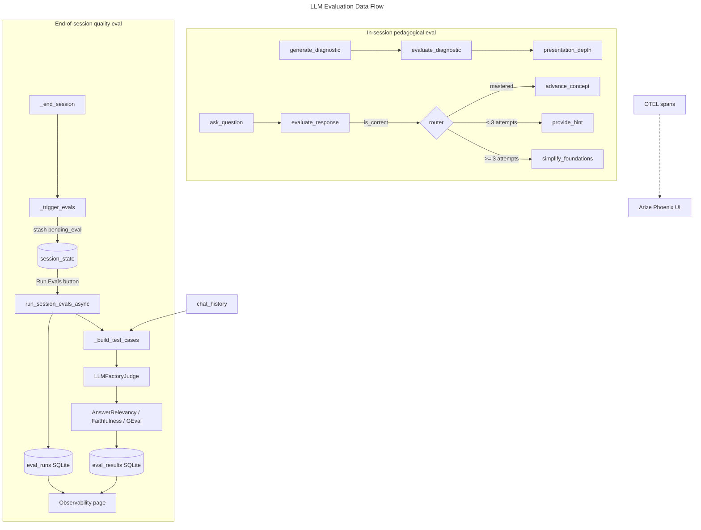

# LLM Evaluation Specification — AI Tutor

Authoritative specification for **LLM-based evaluation ("evals")** in the AI Tutor project.
[`SPEC.md`](SPEC.md) references this file for all eval/observability requirements; Claude uses
it as the single source of truth when generating or modifying eval code.

Two distinct kinds of evaluation exist and must not be conflated:

1. **In-session pedagogical evaluation** — the tutor uses an LLM to judge a student's
   answers and drive mastery progression (the core learning loop).
2. **End-of-session quality evaluation** — DeepEval LLM-as-judge metrics score the tutor's
   own output quality for observability.

Quiz scoring is **not** an LLM eval — it is deterministic answer matching
([`backend/quiz/evaluator.py`](backend/quiz/evaluator.py)) and is out of scope here.

Status legend: `- [x]` implemented · `- [ ]` planned / not yet implemented.

---

## 1. Architecture Overview

---

## 2. In-Session Pedagogical Evaluation

**Location:** [`backend/interactive_tutor/graph.py`](backend/interactive_tutor/graph.py)

| Node | Role | LLM? | Output that drives the graph |
|---|---|---|---|
| `generate_diagnostic` | Produce 3 MCQ pre-questions from title+summary | Yes (tool schema) | `diagnostic_questions` |
| `evaluate_diagnostic` | Score MCQ answers → set depth | No (arithmetic) | `diagnostic_score`, `presentation_depth` (beginner/intermediate/advanced) |
| `ask_question` | Generate an open-ended comprehension question | Yes (tool schema) | `current_question` |
| `evaluate_response` | Judge the student's free-text answer | Yes (tool schema) | `concept_mastered`, `feedback`, `attempts` |
| `provide_hint` | Tailor a hint to the student's error (ChromaDB-grounded) | Yes | appended to `chat_history` |
| `simplify_foundations` | Re-teach from basics after 3 failed attempts | Yes | appended to `chat_history` |

**Requirements:**
- [x] `evaluate_response` judges free-text answers via a tool schema returning a structured
  `is_correct` / `feedback` verdict
- [x] A non-dict judge response falls back to `{"is_correct": False, ...}` so a malformed
  response safely counts as "not mastered"
- [x] `evaluate_diagnostic` deterministically scores the MCQ pre-quiz and sets
  `presentation_depth`, adapting subsequent teaching difficulty
- [x] `_router()` reads `concept_mastered` and `attempts` to choose
  advance / hint / simplify / session-complete
- [x] The judge uses the active app provider/model via `LLMFactory.create()` — no separate
  eval key
- [x] Diagnostic scoring is unit-tested in
  [`tests/test_tutor/test_graph_nodes.py`](tests/test_tutor/test_graph_nodes.py)

---

## 3. End-of-Session Quality Evaluation (DeepEval)

**Runner:** [`backend/observability/eval_runner.py`](backend/observability/eval_runner.py)
`run_session_evals_async()` → `_run()` (fire-and-forget daemon thread; never blocks the UI).

**Metrics (LLM-as-judge, DeepEval):**
| Metric | Source | Threshold | Inputs |
|---|---|---|---|
| `AnswerRelevancyMetric` | DeepEval builtin | 0.5 | input, actual_output |
| `FaithfulnessMetric` | DeepEval builtin | 0.5 | actual_output, retrieval_context |
| `ExplanationClarity` | custom `GEval` | 0.5 | input, actual_output |

**Requirements:**
- [x] **User-triggered evaluation** — `_trigger_evals()` in
  [`frontend/tutor_room.py`](frontend/tutor_room.py) stashes session data in
  `st.session_state["pending_eval"]`; a **Run Evals** button on the Observability page runs
  it so the user controls when to incur API cost
- [x] **DeepEval-compatible judge** — `LLMFactoryJudge` delegates to `LLMFactory`, reusing the
  active app provider/model (Anthropic, Portkey, or Ollama). Provider/model are captured from
  `session_state` before the background thread starts; it exposes `generate`, `a_generate`,
  `load_model`, `get_model_name`, and a `name` property for DeepEval compatibility
- [x] **Concept-scoped retrieval context** — `_trigger_evals` builds a `concept_context` map
  (concept title → enriched `content_md`); `_build_test_cases` uses each slide's own concept
  content as `retrieval_context`, falling back to the full module blob when absent
- [x] **Turn-intent classification** — `_build_test_cases` classifies each tutor turn as
  *question* or *feedback* via `_looks_like_feedback` and sets the case `input` intent to
  match the output. Hints/simplifications are skipped; cases are capped at 10 to bound cost
- [x] **DeepEval 2.x persistence** — `_persist_results()` reads `metrics_data` (fallback to
  1.x `metrics_metadata`) and `name` (fallback to `metric`), so scores persist correctly under
  the pinned `deepeval>=2.0.0`
- [x] **Read-time aggregation** — `get_eval_results()` in
  [`backend/analytics/stats.py`](backend/analytics/stats.py) aggregates raw scores per metric
  per session into **mean**, **pass-rate**, and **count** (no last-write-wins overwrite)
- [x] **Run-status tracking** — `record_eval_run()` writes a row to the `eval_runs` table on
  the success, no-cases, and exception paths; `get_last_eval_run()` returns the most recent
  status (module, case count, error, timestamp)

---

## 4. Display — Observability Page

[`frontend/observability_page.py`](frontend/observability_page.py)

- [x] **Run Evals** button, with a guard message when no session is pending
- [x] Per-session table showing aggregated mean + pass/fail badge per metric
- [x] Raw per-turn scores available in a collapsible expander
- [x] Average-score bar chart across sessions
- [x] Metric descriptions (`_METRIC_DESCRIPTIONS`) in a "What do these metrics measure?"
  expander, explaining each metric and the 0.5 pass threshold
- [x] Last-run status banner (success / info / warning) via `get_last_eval_run`, so silent
  failures are visible
- [x] Link to the Arize Phoenix UI

**Tracing:** [`backend/observability/tracer.py`](backend/observability/tracer.py) sets up
OTEL → Arize Phoenix and instruments the Anthropic + LangChain SDKs.

---

## 5. Persistence Schema

SQLite tables, created lazily by the runner.

- [x] `eval_results` — `result_id, user_id, module_id, scores_json, evaluated_at`;
  `scores_json` holds a list of `{metric, score, threshold, passed, reason}`
- [x] `eval_runs` — `run_id, user_id, module_id, case_count, error, ran_at`

---

## 6. Test Coverage

`tests/test_observability/test_eval_runner.py` — 17 unit tests:

- [x] `_build_test_cases` (slide + Q&A turns, hint/simplify skipping, concept-scoped context,
  10-case cap)
- [x] `_looks_like_feedback` intent classification
- [x] `LLMFactoryJudge.generate` with a stubbed factory
- [x] `_persist_results` against a DeepEval 2.x-shaped result
- [x] `record_eval_run` / `get_last_eval_run`
- [x] `get_eval_results` aggregation (mean / pass-rate / count)

