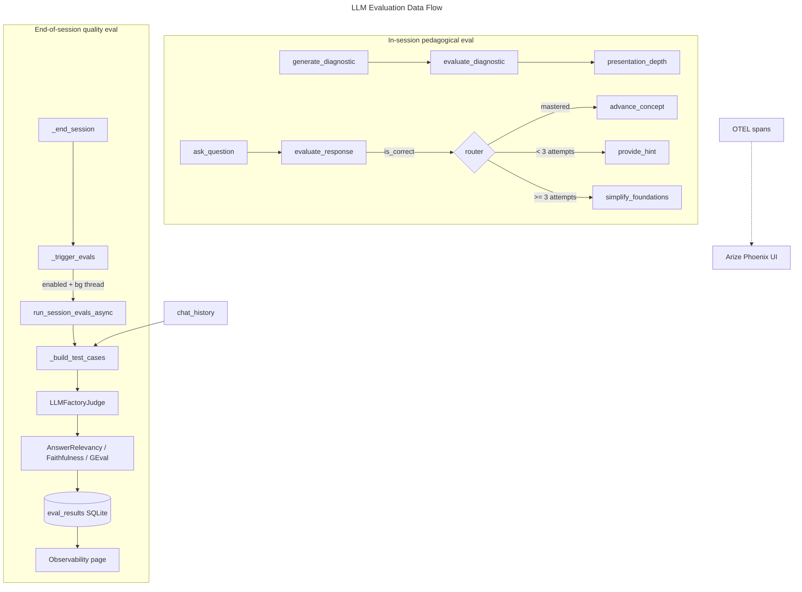

# LLM Evaluation Specification — AI Tutor

This document specifies how **LLM-based evaluation ("evals")** works in the AI Tutor project:
what exists in the code today, and the **improvements/fixes** planned for it. Implementation
is tracked in [llm-eval-plan.md](llm-eval-plan.md).

- **Two distinct kinds of "evaluation" exist** and must not be conflated:
  1. **In-session pedagogical evaluation** — the tutor uses an LLM to judge a student's
     answers and drive mastery progression (core learning loop).
  2. **End-of-session quality evaluation** — DeepEval LLM-as-judge metrics score the tutor's
     own output quality for observability.
- **Quiz scoring is NOT an LLM eval** — it is deterministic answer matching
  ([`backend/quiz/evaluator.py`](backend/quiz/evaluator.py)). It is out of scope here.

---

## 1. Architecture Overview

---

## 2. In-Session Pedagogical Evaluation (existing)

**Location:** [`backend/interactive_tutor/graph.py`](backend/interactive_tutor/graph.py)

| Node | Role | LLM? | Output that drives the graph |
|---|---|---|---|
| `generate_diagnostic` | Produce 3 MCQ pre-questions from title+summary | Yes (tool schema) | `diagnostic_questions` |
| `evaluate_diagnostic` | Score MCQ answers → set depth | No (arithmetic) | `diagnostic_score`, `presentation_depth` (beginner/intermediate/advanced) |
| `ask_question` | Generate an open-ended comprehension question | Yes (tool schema) | `current_question` |
| `evaluate_response` | Judge the student's free-text answer | Yes (tool schema) | `concept_mastered`, `feedback`, `attempts` |
| `provide_hint` | Tailor a hint to the student's error (ChromaDB-grounded) | Yes | appended to `chat_history` |
| `simplify_foundations` | Re-teach from basics after 3 failed attempts | Yes | appended to `chat_history` |

**Routing:** `_router()` reads `concept_mastered` and `attempts` to choose
next_concept / session_complete / hint / simplify.

**Judge model:** the active app provider/model via `LLMFactory.create()`.

**Notes / current behavior**
- `evaluate_response` falls back to `{"is_correct": False, ...}` if the LLM returns a
  non-dict, so a malformed judge response counts as "not mastered" (safe default).
- Diagnostic scoring is deterministic and well unit-tested in
  [`tests/test_tutor/test_graph_nodes.py`](tests/test_tutor/test_graph_nodes.py).

---

## 3. End-of-Session Quality Evaluation (existing)

**Trigger:** [`frontend/tutor_room.py`](frontend/tutor_room.py) `_end_session()` →
`_trigger_evals()` (only if **Evals** is enabled in the sidebar toggle in
[`app.py`](app.py)). Runs in a fire-and-forget daemon thread so it never blocks the UI.

**Runner:** [`backend/observability/eval_runner.py`](backend/observability/eval_runner.py)
`run_session_evals_async()` → `_run()`.

**Metrics (LLM-as-judge, DeepEval):**
| Metric | Source | Threshold | Inputs |
|---|---|---|---|
| `AnswerRelevancyMetric` | DeepEval builtin | 0.5 | input, actual_output |
| `FaithfulnessMetric` | DeepEval builtin | 0.5 | actual_output, retrieval_context |
| `ExplanationClarity` | custom `GEval` | 0.5 | input, actual_output |

**Judge:** `LLMFactoryJudge` — a DeepEval-compatible judge that delegates to the project's
`LLMFactory` (same provider/model as the app; no separate eval API key). Captured from
`session_state` before the thread starts.

**Test-case construction:** `_build_test_cases()` walks `chat_history`:
- each `role == "slide"` → a test case (`input = "Explain the concept: ..."`,
  `actual_output = transcript`, `retrieval_context = [source_text]`).
- each substantive `role == "tutor"` turn (skips `Hint:` / `Let me break`) → a test case
  (`input = "Ask a question about: ..."`, `actual_output = content`,
  `retrieval_context = [slide transcript]`).
- capped at 10 cases to bound judge cost.

**Persistence:** `_persist_results()` writes scores to the `eval_results` table
(`result_id, user_id, module_id, scores_json, evaluated_at`); table created lazily.

**Display:** [`frontend/observability_page.py`](frontend/observability_page.py) reads via
[`backend/analytics/stats.py`](backend/analytics/stats.py) `get_eval_results()` and renders a
per-session table (score + pass/fail badge) and an average-score bar chart.

**Tracing (separate but related):**
[`backend/observability/tracer.py`](backend/observability/tracer.py) sets up OTEL → Arize
Phoenix and instruments the Anthropic + LangChain SDKs. The observability page links to the
Phoenix UI.

---

## 4. Known Issues, Improvements & Fixes

Severity: **H** = correctness/data-loss, **M** = quality/accuracy, **L** = polish.

### F1 (H) — Persisted scores may be empty under DeepEval 2.x
`_persist_results()` reads `tr.metrics_metadata` and `md.metric`
([`eval_runner.py`](backend/observability/eval_runner.py)). DeepEval **2.x** exposes
`TestResult.metrics_data` with `MetricData.name` (the `metrics_metadata`/`.metric` names are
1.x-era). With `deepeval>=2.0.0` pinned in [`pyproject.toml`](pyproject.toml), the inner loop
can silently yield **no scores**, so the dashboard shows blank rows.
**Fix:** read `metrics_data` (fallback to `metrics_metadata`), and `name` (fallback to
`metric`); add a regression test with a synthetic `TestResult`.

### F2 (H) — Dashboard table overwrites repeated metric labels
[`observability_page.py`](frontend/observability_page.py) builds one row per session but
assigns `row[label] = ...` per score; with up to 10 cases × 3 metrics, only the **last**
value for each metric survives, so the per-session table is misleading.
**Fix:** aggregate per metric per session (mean, and/or pass-rate) before display.

### F3 (M) — Faithfulness context is module-wide, not concept-scoped
`source_text` is the concatenation of **all** enriched topics
([`tutor_room.py`](frontend/tutor_room.py)) and is used as `retrieval_context` for every
slide test case. Broad context inflates faithfulness pass rates.
**Fix:** scope `retrieval_context` to the current concept's enriched content.

### F4 (M) — Tutor-turn input intent is mislabeled
Every tutor turn is given `input = "Ask a question about: ..."` even when the output is
answer feedback ([`eval_runner.py`](backend/observability/eval_runner.py) `_build_test_cases`),
adding noise to relevancy/clarity scoring.
**Fix:** classify the turn (question vs. feedback) and set an input intent that matches.

### F5 (M) — No aggregation semantics defined for a "session score"
Results are stored as a flat list; the dashboard averages across sessions but there is no
defined per-session aggregate (mean/min/max/pass-rate).
**Fix:** define and store per-session aggregates alongside raw scores.

### F6 (L) — No automated tests for the eval runner path
There are tutor-node tests but **none** for `run_session_evals_async`, `_build_test_cases`,
`LLMFactoryJudge`, `_persist_results`, or `get_eval_results`.
**Fix:** add unit tests with a stub judge and a fake DeepEval `evaluate` result.

### F7 (L) — Silent failure surface
`_trigger_evals`, `_run`, and `_persist_results` all swallow exceptions (by design, to never
crash the UI), but there is no user-visible signal that evals ran or failed.
**Fix:** record a lightweight status (e.g., last-run timestamp / error) surfaced on the
observability page.

### F8 (L) — Metrics lack descriptions in the UI
The dashboard shows metric names with no explanation of what each measures or what the 0.5
threshold means.
**Fix:** add short metric descriptions and threshold help text.

---

## 5. Non-Goals
- Replacing deterministic quiz scoring with an LLM.
- Adding a second, separate judge provider/key (judge intentionally reuses the app LLM).
- Online/real-time eval during a live tutor turn (evals remain end-of-session, async).

## 6. Open Questions
- Should evals run automatically at session end, or only on explicit user request?
- Should the dashboard show per-turn rows, per-session aggregates, or both?
- Should a minimum cohort size gate the display of average scores (to avoid noisy means)?
