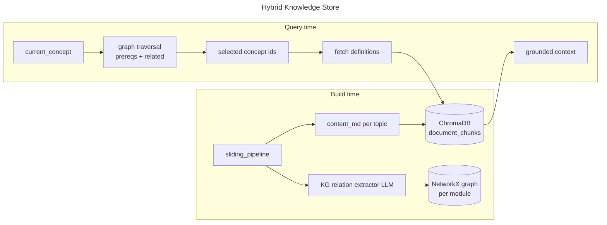
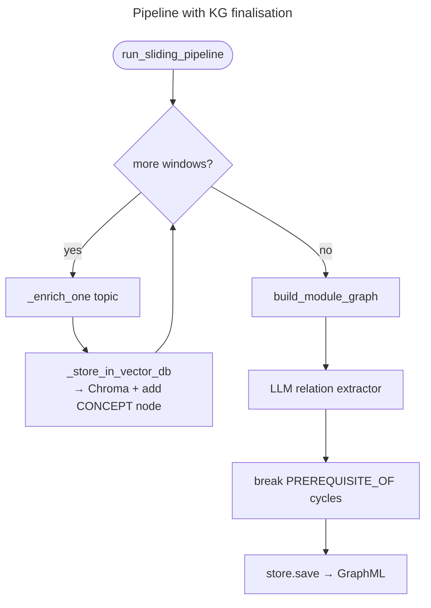

# LLM Knowledge Graph Specification — AI Tutor

> **Version:** 0.1 (draft) | **Last updated:** 2026-06-23
> Authoritative specification for the **LLM-built knowledge graph (KG)** layer.
> [`SPEC.md`](SPEC.md) references this file for all knowledge-graph requirements; the
> implementation plan lives in [`llmgraph_plan.md`](llmgraph_plan.md).

Status legend: `- [x]` implemented · `- [ ]` planned / not yet implemented.

---

## 1. Motivation

Today the tutor treats a module as a **flat, ordered list of topics** (`Topic.order` integer).
The only "retrieval" is a per-module vector similarity lookup against ChromaDB
([`_retrieve_context`](backend/interactive_tutor/graph.py)), which returns the raw Markdown of
the 1–2 most similar topics. There is **no representation of how concepts relate** — no
prerequisites, no "related-to", no concept hierarchy.

This limits the tutor's adaptivity:

- It cannot decide *what to re-teach* when a student fails (it just re-explains the same topic).
- It cannot pull in a **prerequisite** concept the student is actually missing.
- It cannot ground a hint in **related** concepts, only in textually-similar ones.

This spec introduces a **hybrid knowledge store**:

- **ChromaDB keeps the raw text** — the authoritative concept *definitions* (`content_md` per
  topic). This already exists and is unchanged.
- **A NetworkX graph keeps the *relationships*** — typed edges between concepts (prerequisite,
  related, elaborates, mentions-term, …) extracted by the LLM.

Retrieval becomes **graph-guided**: traverse the graph from the current concept to select
*which* concepts are relevant, then fetch their definitions from ChromaDB.



---

## 2. Scope

### In scope

- An **ontology** (node types + typed relationships) for module concepts.
- An **LLM extractor** that builds the graph from a `LearningModule` after content generation.
- A **NetworkX-backed store** with per-module persistence (GraphML under `data/graph/`).
- A **hybrid retrieval** function that combines graph traversal with ChromaDB definition lookup.
- **Rewiring the LangGraph retrieval nodes** (`present_concept`, `provide_hint`,
  `simplify_foundations`, and the `_advance_concept` ordering) to use graph-guided retrieval.

### Out of scope (this version)

- Cross-module / global knowledge graph (graph is **per `module_id`**, matching Chroma scoping).
- A graph database (Neo4j, etc.) — NetworkX + GraphML files is sufficient for the MVP.
- Replacing ChromaDB. The vector store remains the system of record for raw definitions.
- Graph visualisation in the UI (may be a later enhancement).

---

## 3. Ontology

The ontology is defined in code in
[`backend/content/knowledge_graph/ontology.py`](backend/content/knowledge_graph/ontology.py) as
two enums plus light dataclasses. NetworkX stores it as a `nx.MultiDiGraph` (directed, typed,
multiple edge types allowed between a node pair).

### 3.1 Node types — `NodeType`

| Node type | Identity (`node_id`) | Source | Key attributes |
|---|---|---|---|
| `MODULE` | `module_id` | `LearningModule` | `title` |
| `CONCEPT` | `topic_id` | `EnrichedTopic.topic` | `title`, `summary`, `order`, `mastery`-agnostic |
| `TERM` | slugified term string | `EnrichedTopic.top_concepts` / `key_takeaways` | `label` (human text) |

- **`CONCEPT` is the primary node** and maps **1:1 to a `Topic`/`EnrichedTopic`**. Its `node_id`
  is `topic_id` so it lines up with the ChromaDB id convention `f"{module_id}:{topic_id}"` and
  with the tutor's concept strings.
- **`TERM` nodes are finer-grained** named ideas mentioned across concepts (the existing
  free-text `top_concepts` / `key_takeaways`). They let two concepts be linked because they
  *share* a term even when not textually similar.
- The raw **definition text is NOT stored in the graph** — only `title`/`summary` for display
  and traversal. The body lives in ChromaDB. This is the hybrid contract.

### 3.2 Edge types — `RelationType`

All edges are **directed**. `(A) --REL--> (B)` reads "A REL B".

| Relation | Direction meaning | Cardinality | Primary source |
|---|---|---|---|
| `PART_OF` | `CONCEPT --PART_OF--> MODULE` | many→1 | structural (pipeline) |
| `FOLLOWS` | `CONCEPT_n --FOLLOWS--> CONCEPT_{n-1}` | sequential | `Topic.order` (deterministic) |
| `PREREQUISITE_OF` | `A --PREREQUISITE_OF--> B` ⇒ learn A before B | many→many | **LLM** |
| `RELATED_TO` | `A --RELATED_TO--> B` symmetric semantic link | many→many | **LLM** |
| `ELABORATES` | `A --ELABORATES--> B` ⇒ A is a deeper/specialised view of B | many→many | **LLM** |
| `MENTIONS` | `CONCEPT --MENTIONS--> TERM` | many→many | structural + LLM |
| `DEFINES` | `CONCEPT --DEFINES--> TERM` ⇒ this concept is the canonical definition | 1→1 per term | **LLM** |

**Edge attributes:** every edge carries `relation` (the `RelationType` value), `weight`
(float 0–1, LLM confidence; deterministic edges = 1.0), and `source` (`"llm"` | `"structural"`).

### 3.3 Ontology constraints

- [ ] `PREREQUISITE_OF` edges **must be acyclic** across `CONCEPT` nodes. After extraction the
  builder runs a cycle check (`nx.simple_cycles`); detected cycles are broken by dropping the
  lowest-`weight` edge in each cycle and logged.
- [ ] `RELATED_TO` is conceptually symmetric but stored as a single directed edge; traversal
  treats it as bidirectional.
- [ ] Only `CONCEPT` and `MODULE` nodes are created deterministically by the pipeline. `TERM`
  nodes and all `PREREQUISITE_OF`/`RELATED_TO`/`ELABORATES`/`DEFINES` edges are LLM-produced.
- [ ] Node ids are stable across regeneration so the graph can be rebuilt idempotently.

---

## 4. LLM extraction

**Location:** [`backend/content/knowledge_graph/extractor.py`](backend/content/knowledge_graph/extractor.py)

The extractor runs **once per module, after all topics are enriched** (it needs the full set of
concepts to reason about cross-links). It uses the existing synchronous LLM surface:

```python
llm.generate(prompt, system=..., tool_schema=<relation_schema>)  # returns dict
```

(`BaseLLMClient.generate` with an Anthropic-format `tool_schema` — same pattern as
`generate_diagnostic` / `ask_question`.)

### 4.1 Input

A compact catalogue of the module's concepts — for each `CONCEPT`: `topic_id`, `title`,
`summary`, `order`, and its `top_concepts`/`key_takeaways` term labels. The full `content_md` is
**not** sent (token cost); summaries + terms are sufficient to infer relationships.

### 4.2 Tool schema (output contract)

```jsonc
{
  "name": "emit_knowledge_graph",
  "description": "Typed relationships between the module's concepts.",
  "input_schema": {
    "type": "object",
    "properties": {
      "edges": {
        "type": "array",
        "items": {
          "type": "object",
          "properties": {
            "source_id": { "type": "string" },   // topic_id or term slug
            "target_id": { "type": "string" },
            "relation":  { "type": "string",
                           "enum": ["PREREQUISITE_OF","RELATED_TO","ELABORATES","DEFINES","MENTIONS"] },
            "confidence":{ "type": "number" }      // 0..1
          },
          "required": ["source_id","target_id","relation","confidence"]
        }
      }
    },
    "required": ["edges"]
  }
}
```

### 4.3 Requirements

- [ ] The extractor only emits edges between **known node ids** (concept `topic_id`s or term
  slugs it is told about). Unknown ids are dropped with a warning (`coerce_tool_array` is used
  to normalise Claude's occasional JSON-string arrays, mirroring existing code).
- [ ] Extraction is **non-fatal**: any LLM/parse failure logs and yields a graph with only the
  deterministic `PART_OF` + `FOLLOWS` + structural `MENTIONS` edges (the tutor still works).
- [ ] Extraction emits an OpenTelemetry span via the existing tracer
  ([`backend/observability/tracer.py`](backend/observability/tracer.py)) named `kg.extract`.

---

## 5. Storage & persistence

**Location:** [`backend/content/knowledge_graph/store.py`](backend/content/knowledge_graph/store.py)

- In-memory representation: `networkx.MultiDiGraph`.
- Persistence: **one GraphML file per module** at
  `data/graph/{module_id}.graphml` (mirrors `data/chroma/` scoping). Env override
  `AI_TUTOR_GRAPH_DIR` (default `data/graph`).
- `KnowledgeGraphStore` API:

```python
class KnowledgeGraphStore:
    def __init__(self, module_id: str): ...
    def add_concept(self, topic_id, title, summary, order) -> None
    def add_term(self, label) -> str            # returns slug node_id
    def add_edge(self, src, dst, relation, weight=1.0, source="llm") -> None
    def save(self) -> Path                       # write GraphML
    @classmethod
    def load(cls, module_id) -> "KnowledgeGraphStore | None"
    # traversal helpers (see §6)
    def prerequisites(self, topic_id, depth=1) -> list[str]
    def related(self, topic_id, k=3) -> list[str]
    def neighborhood(self, topic_id, depth=1) -> list[str]
    def teaching_order(self) -> list[str]        # topological sort over PREREQUISITE_OF
```

### Requirements

- [ ] `add_concept` / `add_edge` are **idempotent** — rebuilding a module overwrites cleanly.
- [ ] `save()` is called by the pipeline after extraction; `load()` is best-effort and returns
  `None` if no graph file exists (callers must degrade to vector-only retrieval).
- [ ] GraphML is chosen because it round-trips typed node/edge attributes and is human-inspectable
  (debuggability). NetworkX `write_graphml` / `read_graphml` are used. `weight` is serialised as
  a float; enums are serialised as their string values.

---

## 6. Hybrid retrieval (rewire of LangGraph nodes)

**Location:** [`backend/content/knowledge_graph/retrieval.py`](backend/content/knowledge_graph/retrieval.py)
**Rewires:** [`_retrieve_context`](backend/interactive_tutor/graph.py) and its callers.

### 6.1 New retrieval contract

```python
def graph_guided_context(
    module_id: str,
    topic_id: str | None,        # the current concept node, when known
    query_text: str,             # free-text fallback / vector query
    mode: str = "present",       # "present" | "hint" | "simplify"
    max_defs: int = 3,
) -> str:
    ...
```

**Algorithm:**

1. Load `KnowledgeGraphStore.load(module_id)`. If `None` → fall back to today's pure-vector
   `_retrieve_context(module_id, query_text)` (unchanged behaviour).
2. Pick candidate concept ids by `mode`:
   - `present` → `related(topic_id, k)` ∪ direct `prerequisites(topic_id, depth=1)`.
   - `hint` → `prerequisites(topic_id, depth=1)` first (the missing-foundation case), then
     `related`.
   - `simplify` → `prerequisites(topic_id, depth=2)` ordered by `teaching_order()` (re-teach
     from the deepest foundation upward).
3. Fetch each candidate's **definition text from ChromaDB** by id
   (`query_vector_db` with `where_filter={"module_id", "topic_id"}`), preserving the existing
   storage-server tool. The graph chooses *which*; Chroma supplies the *text*.
4. If graph yields too few candidates, top up with vector similarity on `query_text`.
5. Concatenate definitions (capped at `max_defs`) and return — same string shape the nodes
   already consume, so the call sites change minimally.

### 6.2 Node rewiring

| Node | Today | After |
|---|---|---|
| `present_concept` | `_retrieve_context(module_id, title)` fallback | `graph_guided_context(..., topic_id, mode="present")` |
| `provide_hint` | `_retrieve_context(module_id, question)` | `graph_guided_context(..., topic_id, mode="hint")` |
| `simplify_foundations` | re-teaches same concept | pulls prerequisite definitions via `mode="simplify"` |
| `_advance_concept` | pops `remaining_concepts[0]` (linear `order`) | optionally order `remaining_concepts` by `teaching_order()` (prereq-aware) |

### 6.3 Requirements

- [ ] `topic_id` must be threaded into `GraphState` so retrieval can anchor on the graph node.
  Add `current_topic_id: str` to `GraphState` and populate it wherever `current_concept` is set
  (it is already available on `EnrichedTopic.topic.topic_id`).
- [ ] Retrieval remains **best-effort**: any exception returns `""` (current contract), so a
  missing/corrupt graph never breaks a session.
- [ ] **Driver caveat:** the tutor executes nodes via `_run_node` in
  [`frontend/tutor_room.py`](frontend/tutor_room.py), not `graph.invoke()`. Node-internal
  retrieval changes take effect automatically; **no new graph nodes/edges are introduced**, so
  `_run_node`'s `node_map` does not need changes for this version.

---

## 7. Pipeline integration

**Rewires:** [`run_sliding_pipeline`](backend/content/sliding_pipeline.py) and
[`_store_in_vector_db`](backend/content/sliding_pipeline.py).

- [ ] `_store_in_vector_db` (called per enriched topic) **additionally** registers a `CONCEPT`
  node + `PART_OF`/`FOLLOWS`/structural `MENTIONS` edges into an in-progress
  `KnowledgeGraphStore`. Chroma write is unchanged.
- [ ] After the pipeline finishes all topics, a new finalisation step
  (`build_module_graph(module, llm, store, tracer)`) runs the LLM extractor (§4), adds LLM edges,
  enforces acyclicity (§3.3), and calls `store.save()`.
- [ ] Graph build is **non-blocking for delivery**: just-in-time topic delivery is unaffected;
  the graph becomes available once the full module is built. Until then retrieval falls back to
  vector-only.



---

## 8. Dependencies

- [ ] `networkx` — added via `uv add networkx` (not currently in `pyproject.toml`). Update
  `pyproject.toml` `[project] dependencies` and `uv.lock`.
- No other new dependencies. ChromaDB, the LLM factory, and the MCP storage server are reused.

---

## 9. Testing

New tests under `tests/test_content/` and `tests/test_tutor/`:

- [ ] `test_ontology.py` — node/edge enums, slug stability, edge attribute round-trip.
- [ ] `test_kg_store.py` — add/save/load GraphML round-trip; `prerequisites`, `related`,
  `teaching_order` traversals; cycle-breaking.
- [ ] `test_kg_extractor.py` — extractor with a stubbed LLM returning a fixed `edges` payload;
  unknown-id dropping; non-fatal failure path.
- [ ] `test_graph_guided_retrieval.py` — graph present ⇒ graph-guided ids; graph absent ⇒ falls
  back to `_retrieve_context` (vector-only). Uses a fake storage-server client.
- [ ] All KG code degrades gracefully: with no graph file, existing tutor tests must still pass
  unchanged.

---

## 10. Open questions

1. **Term granularity** — should `TERM` nodes be deduplicated across modules (global term
   vocabulary) or kept strictly per-module? *Current decision: per-module* (matches Chroma
   scoping); revisit if cross-module recommendations are wanted.
2. **Prereq-aware ordering** — should `_advance_concept` *always* reorder by `teaching_order()`,
   or only when the linear `order` conflicts with prerequisites? *Proposed: only reorder when a
   prerequisite would otherwise be taught after its dependent* (least surprise).
3. **Extraction cost** — one extra LLM call per module. Acceptable? If summaries are large,
   consider chunked extraction. *Proposed: single call for MVP; revisit on token limits.*
4. **Graph visualisation** — expose the per-module graph in the observability page? *Deferred.*
