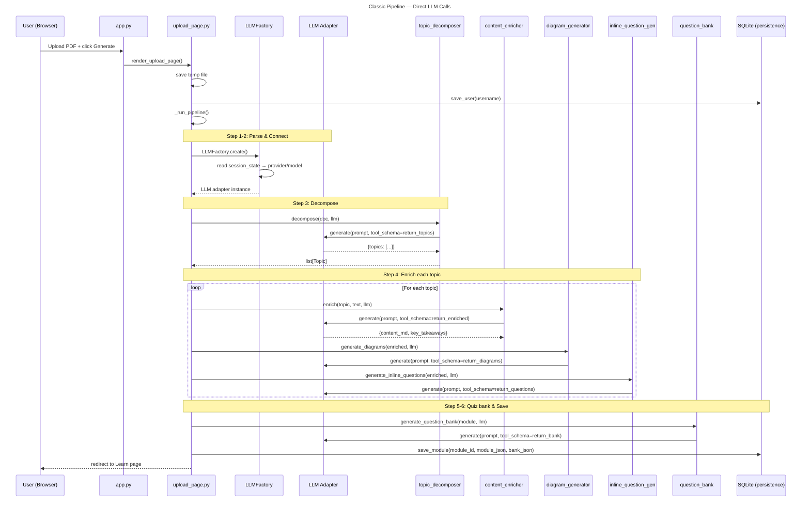
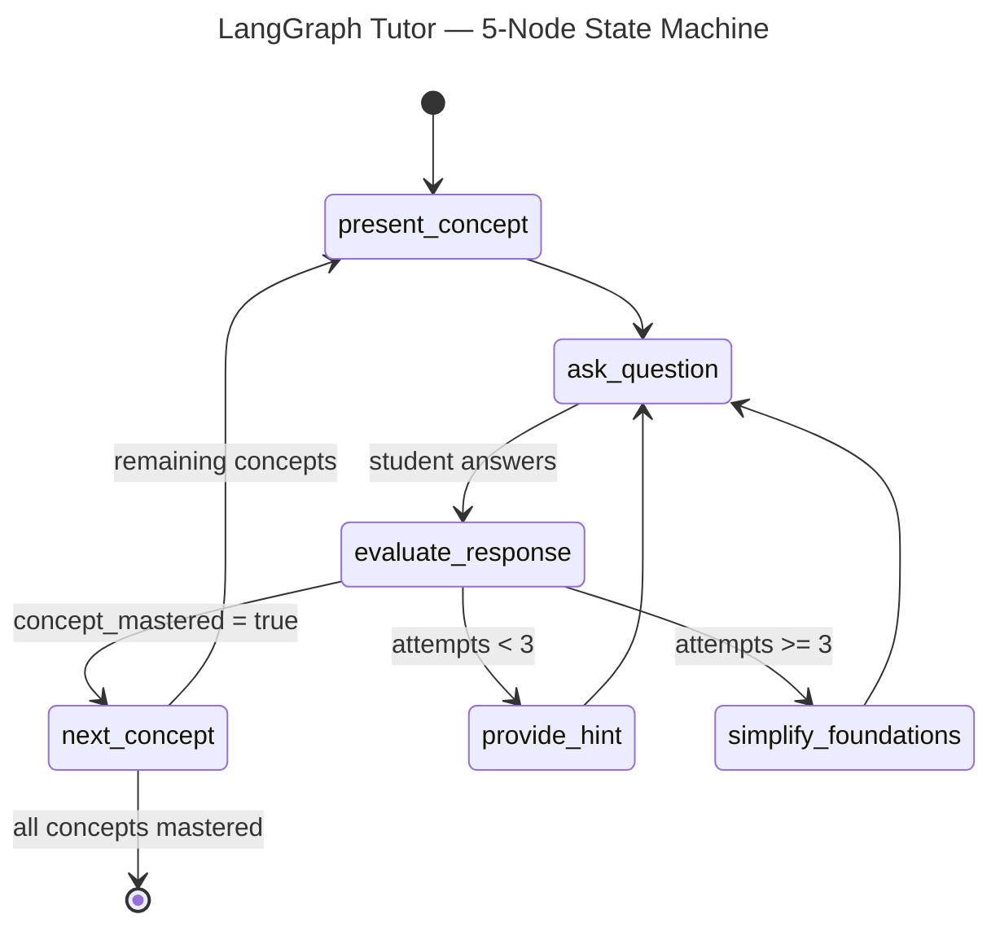

# AI Tutor — Control Flow Diagrams

## Classic Pipeline (Direct LLM)

```mermaid
---
title: Classic Pipeline — Direct LLM Calls
---
sequenceDiagram
    participant U as User (Browser)
    participant A as app.py
    participant UP as upload_page.py
    participant F as LLMFactory
    participant LLM as LLM Adapter
    participant TD as topic_decomposer
    participant CE as content_enricher
    participant DG as diagram_generator
    participant IQ as inline_question_gen
    participant QB as question_bank
    participant DB as SQLite (persistence)

    U->>A: Upload PDF + click Generate
    A->>UP: render_upload_page()
    UP->>UP: save temp file
    UP->>DB: save_user(username)
    UP->>UP: _run_pipeline()

    Note over UP,LLM: Step 1-2: Parse & Connect
    UP->>F: LLMFactory.create()
    F->>F: read session_state → provider/model
    F-->>UP: LLM adapter instance

    Note over UP,TD: Step 3: Decompose
    UP->>TD: decompose(doc, llm)
    TD->>LLM: generate(prompt, tool_schema=return_topics)
    LLM-->>TD: {topics: [...]}
    TD-->>UP: list[Topic]

    Note over UP,IQ: Step 4: Enrich each topic
    loop For each topic
        UP->>CE: enrich(topic, text, llm)
        CE->>LLM: generate(prompt, tool_schema=return_enriched)
        LLM-->>CE: {content_md, key_takeaways}
        UP->>DG: generate_diagrams(enriched, llm)
        DG->>LLM: generate(prompt, tool_schema=return_diagrams)
        UP->>IQ: generate_inline_questions(enriched, llm)
        IQ->>LLM: generate(prompt, tool_schema=return_questions)
    end

    Note over UP,DB: Step 5-6: Quiz bank & Save
    UP->>QB: generate_question_bank(module, llm)
    QB->>LLM: generate(prompt, tool_schema=return_bank)
    UP->>DB: save_module(module_id, module_json, bank_json)
    UP-->>U: redirect to Learn page
```

**Call count:** 1 + (N topics x 3) + 1 = **3N + 2 LLM calls**

---

## LangGraph Interactive Tutor

```mermaid
---
title: LangGraph Tutor — 5-Node State Machine
---
stateDiagram-v2
    [*] --> present_concept
    present_concept --> ask_question

    ask_question --> evaluate_response: student answers

    evaluate_response --> next_concept: concept_mastered = true
    evaluate_response --> provide_hint: attempts < 3
    evaluate_response --> simplify_foundations: attempts >= 3

    provide_hint --> ask_question
    simplify_foundations --> ask_question

    next_concept --> present_concept: remaining concepts
    next_concept --> [*]: all concepts mastered
```

